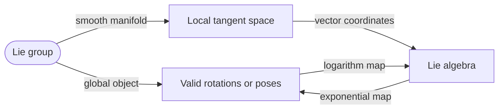
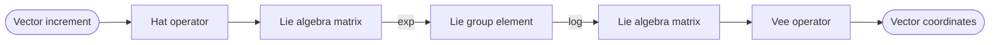
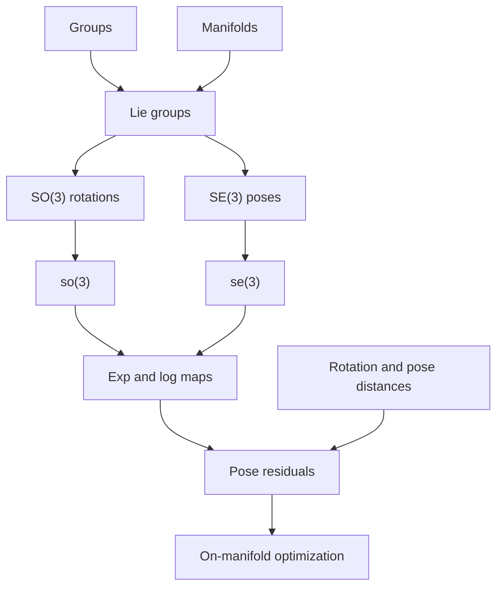

# Lecture 4 - Lie Groups

_MIT 16.485 Visual Navigation for Autonomous Vehicles study report based on the Lecture 4 notes._

---

## 📋 Overview

This lecture reframes rotations and poses from earlier visual navigation material using the language of **Lie groups** and **Lie algebras**. The main goal is to make rotations and rigid-body poses easier to manipulate in later topics such as visual odometry, SLAM, and on-manifold optimization.

The core idea is simple but powerful: rotations and poses do not naturally live in ordinary Euclidean vector spaces, but each one has a nearby linear tangent space where small increments, derivatives, and optimization updates are much easier to express.

> [!summary]
> A Lie group lets us compose poses globally, while its Lie algebra gives us a local vector-space representation for small updates.

This lecture covers four connected themes:

| Theme | Main question | Why it matters |
| --- | --- | --- |
| Groups and Lie groups | What algebraic and geometric structure do rotations and poses have? | Pose composition and inversion become formal operations |
| Lie algebras | How do we represent small motion increments linearly? | Optimization needs vector updates |
| Exponential and logarithm maps | How do we move between local vectors and group elements? | Residuals and updates must move on and off the manifold |
| Distances | How do we measure errors between rotations or poses? | SLAM and visual navigation minimize pose errors |

## 📚 Groups, manifolds, and Lie groups

### Group definition

A **group** $G$ is a set of elements with a binary operation $\otimes$ satisfying four axioms:

| Axiom         | Meaning                                       | Formula                                             |
| ------------- | --------------------------------------------- | --------------------------------------------------- |
| Closure       | Combining two elements stays inside the group | $A, B \in G \Rightarrow A \otimes B \in G$          |
| Associativity | Parentheses do not change the result          | $(A \otimes B) \otimes C = A \otimes (B \otimes C)$ |
| Identity      | There is a neutral element                    | $A \otimes I = I \otimes A = A$                     |
| Inverse       | Every element can be undone                   | $A \otimes A^{-1} = A^{-1} \otimes A = I$           |

For matrix groups in this lecture, the operation $\otimes$ is usually ordinary matrix multiplication.

> [!warning]
> A group is not automatically a vector space. Vector spaces support addition and scalar multiplication; many rotation and pose spaces do not support those operations in a way that preserves valid rotations or poses.

### Groups used in visual navigation

The lecture focuses on matrix groups that appear constantly in robotics and visual navigation.

| Group               | Definition                                                    | Interpretation                                       |
| ------------------- | ------------------------------------------------------------- | ---------------------------------------------------- |
| $GL(d, \mathbb{R})$ | Invertible $d \times d$ real matrices                         | General linear transformations                       |
| $O(d)$              | $\{R \in \mathbb{R}^{d \times d}: R^T R = I_d\}$              | Orthogonal transformations, including reflections    |
| $SO(d)$             | $\{R \in \mathbb{R}^{d \times d}: R^T R = I_d,\ \det(R)=+1\}$ | Proper rotations, not reflect coordination with axis |
| $SE(d)$             | Homogeneous rigid transformation matrices                     | Rigid-body poses                                     |

The two most important groups for this course are $SO(3)$ and $SE(3)$:

$$
SO(3) = \{R \in \mathbb{R}^{3 \times 3}: R^T R = I_3,\ \det(R)=1\}
$$

$$
SE(3) =
\left\{
T =
\begin{bmatrix}
R & t \\
0^T & 1
\end{bmatrix}
: R \in SO(3),\ t \in \mathbb{R}^3
\right\}
$$

Most of these groups are **non-abelian**, meaning:

$$
A \otimes B \neq B \otimes A
$$

For poses, this is intuitive: rotating and then translating usually does not produce the same result as translating and then rotating.

### Manifold intuition

A **manifold** is a space that may be curved globally but looks flat locally. The standard example is a surface embedded in a higher-dimensional space: around a single point, the surface can be approximated by a flat tangent plane.

| ![[attachments/lecture-4-manifold-tangent-space.png]] |
| :---: |
| Figure 4.1: A manifold $\mathcal{M}$ and the tangent space $T_x\mathcal{M}$ at a point $x$. |

Key geometric terms:

| Term                           | Meaning                                                                                                           |
| ------------------------------ | ----------------------------------------------------------------------------------------------------------------- |
| Manifold $\mathcal{M}$         | A space where every local neighborhood resembles $\mathbb{R}^d$                                                   |
| Tangent space $T_x\mathcal{M}$ | A vector space that locally approximates the manifold near $x$                                                    |
| Chart                          | A local coordinate map from the manifold to Euclidean space                                                       |
| Atlas                          | A collection of charts covering the manifold                                                                      |
| Differentiable manifold        | A manifold whose charts transition smoothly                                                                       |
| Riemannian manifold            | A smooth manifold equipped with a metric for measuring distances (Geodesic) like in Euler distance in Euler space |
| Geodesic                       | The shortest curve between two points on a manifold                                                               |

> [!tip]
> Think of the tangent space as the place where calculus is easy. The manifold is where valid rotations and poses live; the tangent space is where small updates and derivatives are computed.

### Lie group definition

A **Lie group** is both a group and a smooth manifold. In this lecture, a matrix Lie group $G \subset \mathbb{R}^N$ must satisfy:

1. $G$ is a manifold embedded in $\mathbb{R}^N$
2. Composition and inverse are smooth operations

For robotics, this matters because $SO(3)$ and $SE(3)$ are not just sets of matrices. They have smooth local structure, which lets us define derivatives, local coordinates, and meaningful distances.

## 📚 Lie algebras

Every matrix Lie group has an associated **Lie algebra**. For this lecture, the most important part of the Lie algebra is its role as the tangent vector space around the identity.

The Lie algebra is useful because it gives us a vector representation of small rotations or motions. That vector can be optimized, differentiated, or used as an error residual.

### The Lie algebra of $SO(3)$

The Lie algebra of $SO(3)$ is denoted $\mathfrak{so}(3)$. It is the set of $3 \times 3$ skew-symmetric matrices:

$$
\mathfrak{so}(3) =
\left\{
\begin{bmatrix}
0 & -\phi_3 & \phi_2 \\
\phi_3 & 0 & -\phi_1 \\
-\phi_2 & \phi_1 & 0
\end{bmatrix}
: \phi =
\begin{bmatrix}
\phi_1 \\
\phi_2 \\
\phi_3
\end{bmatrix}
\in \mathbb{R}^3
\right\}
$$

The **hat operator** maps a vector in $\mathbb{R}^3$ to a skew-symmetric matrix:

$$
\phi^\wedge =
\begin{bmatrix}
0 & -\phi_3 & \phi_2 \\
\phi_3 & 0 & -\phi_1 \\
-\phi_2 & \phi_1 & 0
\end{bmatrix}
$$

The **vee operator** reverses that mapping:

$$
(\phi^\wedge)^\vee = \phi
$$

> [!info]
> The vector $\phi$ is often interpreted as an axis-angle-like rotation vector. Its direction is the rotation axis and its norm is the rotation angle.

### The Lie algebra of $SE(3)$

The Lie algebra of $SE(3)$ is denoted $\mathfrak{se}(3)$. Its elements are $4 \times 4$ matrices built from a rotational part $\phi$ and a translational part $\rho$:

$$
\mathfrak{se}(3) =
\left\{
\begin{bmatrix}
\phi^\wedge & \rho \\
0_3^T & 0
\end{bmatrix}
: \rho, \phi \in \mathbb{R}^3
\right\}
$$

The lecture uses the stacked vector:

$$
\xi =
\begin{bmatrix}
\phi \\
\rho
\end{bmatrix}
\in \mathbb{R}^6
$$

with the overloaded hat operator:

$$
\xi^\wedge =
\begin{bmatrix}
\phi \\
\rho
\end{bmatrix}^{\wedge}
=
\begin{bmatrix}
\phi^\wedge & \rho \\
0_3^T & 0
\end{bmatrix}
$$

and vee operator:

$$
\left(
\begin{bmatrix}
\phi^\wedge & \rho \\
0_3^T & 0
\end{bmatrix}
\right)^\vee
=
\begin{bmatrix}
\phi \\
\rho
\end{bmatrix}
$$

> [!warning]
> Different robotics libraries may order $\xi$ as $[\rho,\phi]$ instead of $[\phi,\rho]$. Always check the convention before comparing formulas or code.

## ⚙️ Exponential and logarithm maps

The exponential and logarithm maps connect the Lie algebra and the Lie group.

### General matrix exponential

For a Lie algebra element $A = a^\wedge$, the exponential map produces a group element:

$$
G = \exp(A) = \sum_{n=0}^{\infty}\frac{1}{n!}A^n
$$

The logarithm map goes the other way:

$$
A = \log(G) = \sum_{n=1}^{\infty}\frac{(-1)^{n-1}}{n}(G-I)^n
$$

In practice, $SO(3)$ and $SE(3)$ have closed-form formulas that are more useful than directly evaluating these infinite series.

### Exponential map for $SO(3)$

Let:

$$
\theta = \|\phi\|,\qquad u = \frac{\phi}{\|\phi\|}
$$

Then $\phi = \theta u$, where $u$ is the unit rotation axis and $\theta$ is the rotation angle. The exponential map for $SO(3)$ is Rodrigues' formula:

$$
R = \exp(\phi^\wedge)
= \cos(\theta)I_3
+ \sin(\theta)u^\wedge
+ (1-\cos(\theta))uu^T
$$

An equivalent form written directly in terms of $\phi^\wedge$ is:

$$
R = I_3
+ \frac{\sin \theta}{\theta}\phi^\wedge
+ \frac{1-\cos \theta}{\theta^2}(\phi^\wedge)^2
$$

This shows why $\phi$ is called the **exponential coordinate** of the rotation.

### Logarithm map for $SO(3)$

For $R \in SO(3)$, the rotation angle is:

$$
\theta = \arccos\left(\frac{\operatorname{tr}(R)-1}{2}\right)
$$

When $R \neq I_3$, the logarithm is:

$$
\log(R) =
\frac{\theta}{2\sin\theta}(R - R^T)
$$

Then the vector form is:

$$
\phi = \log(R)^\vee
$$

> [!tip]
> The logarithm map answers: "What local rotation vector would produce this rotation through the exponential map?"

### Exponential map for $SE(3)$

For:

$$
\xi =
\begin{bmatrix}
\phi \\
\rho
\end{bmatrix}
$$

the $SE(3)$ exponential map is:

$$
T = \exp(\xi^\wedge)
=
\begin{bmatrix}
\exp(\phi^\wedge) & J_l(\phi)\rho \\
0_3^T & 1
\end{bmatrix}
$$

where $J_l(\phi)$ is the left Jacobian of $SO(3)$:

$$
J_l(\phi)
= I_3
+ \frac{1-\cos\|\phi\|}{\|\phi\|^2}\phi^\wedge
+ \frac{\|\phi\|-\sin\|\phi\|}{\|\phi\|^3}\phi^\wedge\phi^\wedge
$$

This Jacobian accounts for the fact that translation and rotation are coupled in rigid-body motion.

### Logarithm map for $SE(3)$

For:

$$
T =
\begin{bmatrix}
R & t \\
0_3^T & 1
\end{bmatrix}
$$

the logarithm map recovers:

$$
\phi = \log(R)^\vee
$$

and:

$$
\rho = J_l^{-1}(\phi)t
$$

so:

$$
\log(T)^\vee =
\begin{bmatrix}
\phi \\
J_l^{-1}(\phi)t
\end{bmatrix}
$$

with:

$$
J_l^{-1}(\phi)
= I_3
- \frac{1}{2}\phi^\wedge
+ \left(
\frac{1}{\|\phi\|^2}
- \frac{1+\cos\|\phi\|}{2\|\phi\|\sin\|\phi\|}
\right)
\phi^\wedge\phi^\wedge
$$

> [!info]
> The exponential maps for $SO(3)$ and $SE(3)$ are surjective but not one-to-one. Multiple Lie algebra vectors can produce the same group element, especially because rotations wrap around by multiples of $2\pi$.

### Step-by-step: applying a pose update

When later optimization methods estimate a small pose increment, the update often follows this pattern:

1. Represent the increment as a vector $\delta \xi \in \mathbb{R}^6$
2. Convert it to a Lie algebra element using $\delta \xi^\wedge$
3. Map it to $SE(3)$ using $\exp(\delta \xi^\wedge)$
4. Compose it with the current pose estimate
5. Continue optimization on the valid pose manifold

Depending on convention, the update may be left-multiplied or right-multiplied:

$$
T_{\text{new}} = \exp(\delta \xi^\wedge)T
$$

or:

$$
T_{\text{new}} = T\exp(\delta \xi^\wedge)
$$

> [!warning]
> Left and right updates are not interchangeable on non-abelian groups. The order changes the frame in which the perturbation is interpreted.

## 📊 Distances

Many visual navigation problems require measuring how different two rotations or poses are. This lecture introduces several distances, each with different analytical and computational tradeoffs.

### Metric properties

A true metric $\operatorname{dist}(a,b)$ satisfies:

$$
\operatorname{dist}(a,b) \ge 0
$$

$$
\operatorname{dist}(a,b)=0 \Longleftrightarrow a=b
$$

$$
\operatorname{dist}(a,b)=\operatorname{dist}(b,a)
$$

$$
\operatorname{dist}(a,c)
\le
\operatorname{dist}(a,b)+\operatorname{dist}(b,c)
$$

These are non-negativity, identity, symmetry, and the triangle inequality.

### Angular distance in $SO(3)$

Given two rotations $R_A, R_B \in SO(3)$, compute their relative rotation:

$$
R_{AB}=R_A^T R_B
$$

The angular distance is the angle of this relative rotation:

$$
\operatorname{dist}_{\theta}(R_A,R_B)
=
\arccos\left(
\frac{\operatorname{tr}(R_A^T R_B)-1}{2}
\right)
$$

Using the logarithm map:

$$
\operatorname{dist}_{\theta}(R_A,R_B)
=
\|\log(R_A^T R_B)^\vee\|
=
\|\log(R_B^T R_A)^\vee\|
$$

This is a **geodesic distance** on $SO(3)$: it measures the length of the shortest path between two rotations on the rotation manifold.

It is also bi-invariant:

$$
\operatorname{dist}_{\theta}(R_A,R_B)
=
\operatorname{dist}_{\theta}(R_C R_A,R_C R_B)
=
\operatorname{dist}_{\theta}(R_A R_C,R_B R_C)
$$

### Chordal distance in $SO(3)$

The chordal distance uses the Frobenius norm:

$$
\operatorname{dist}_c(R_A,R_B)
=
\|R_A-R_B\|_F
$$

The Frobenius norm is:

$$
\|M\|_F
=
\sqrt{\sum_{i,j}M_{ij}^2}
=
\sqrt{\operatorname{tr}(MM^T)}
$$

|                                            ![[attachments/lecture-4-angular-chordal-distance.png]]                                            |
| :-------------------------------------------------------------------------------------------------------------------------------------------: |
| Figure 4.2: Angular distance follows the circle/manifold, while chordal distance measures the straight-line chord between embedded rotations. |

For rotations, chordal and angular distances are related by:

$$
\operatorname{dist}_c(R_A,R_B)
=
2\sqrt{2}\left|\sin\left(\frac{\theta}{2}\right)\right|
$$

For small angles:

$$
\operatorname{dist}_c(R_A,R_B)
\approx
\sqrt{2}\operatorname{dist}_{\theta}(R_A,R_B)
$$

> [!tip]
> Angular distance is geometrically natural. Chordal distance is often algebraically convenient because it avoids the matrix logarithm.

### Quaternion distance

If two rotations are represented as unit quaternions $q_A$ and $q_B$, a simple Euclidean distance is:

$$
\operatorname{dist}_q(q_A,q_B)
=
\|q_A-q_B\|
$$

The problem is that $q_B$ and $-q_B$ represent the same physical rotation, but:

$$
\operatorname{dist}_q(q_A,q_B)
\neq
\operatorname{dist}_q(q_A,-q_B)
$$

A common fix is:

$$
\operatorname{dist}_q(q_A,q_B)
=
\min_{b \in \{-1,+1\}}\|q_A-bq_B\|
$$

This handles the sign ambiguity, but it introduces a binary choice and becomes a pseudo-metric rather than a clean metric in the strict identity sense.

> [!warning]
> Quaternion signs are a common source of bugs. If a cost function treats $q$ and $-q$ as different rotations, it can create artificial discontinuities.

### Pose distances in $SE(3)$

For poses:

$$
T_A =
\begin{bmatrix}
R_A & t_A \\
0_3^T & 1
\end{bmatrix},
\qquad
T_B =
\begin{bmatrix}
R_B & t_B \\
0_3^T & 1
\end{bmatrix}
$$

one direct Lie-group distance is:

$$
\operatorname{dist}_g(T_A,T_B)
=
\|\log(T_A^{-1}T_B)^\vee\|
$$

The lecture notes that robotics literature often prefers the **double geodesic distance**:

$$
\operatorname{dist}_{dg}(T_A,T_B)
=
\sqrt{
\|\log(R_A^T R_B)^\vee\|^2
+ \|t_B-t_A\|^2
}
$$

This treats $SE(3)$ as a combination of rotation distance and Euclidean translation distance.

The chordal pose distance is:

$$
\operatorname{dist}_c(T_A,T_B)
=
\|T_A-T_B\|_F
$$

By inspection:

$$
\operatorname{dist}_c(T_A,T_B)
=
\sqrt{
\operatorname{dist}_c(R_A,R_B)^2
+ \|t_B-t_A\|^2
}
$$

Both $\operatorname{dist}_g$ and $\operatorname{dist}_{dg}$ are left-invariant:

$$
\operatorname{dist}(T_A,T_B)
=
\operatorname{dist}(T_C T_A,T_C T_B)
$$

> [!warning]
> Pose distances mix angular quantities measured in radians and translation quantities measured in meters. Practical systems often need weighting factors so rotation and translation errors are balanced meaningfully.

### Distance comparison table

| Distance        | Space            | Formula idea                            | Strength                            | Caution                                      |
| --------------- | ---------------- | --------------------------------------- | ----------------------------------- | -------------------------------------------- |
| Angular         | $SO(3)$          | $\|\log(R_A^T R_B)^\vee\|$              | Geodesic and interpretable          | Requires log or arccos                       |
| Chordal         | $SO(3)$          | $\|R_A-R_B\|_F$                         | Simple algebra                      | Not the geodesic length                      |
| Quaternion      | Unit quaternions | $\|q_A-q_B\|$                           | Easy when rotations are quaternions | Sign ambiguity                               |
| Double geodesic | $SE(3)$          | Rotation geodesic plus translation norm | Common in robotics                  | Needs unit weighting                         |
| Chordal pose    | $SE(3)$          | $\|T_A-T_B\|_F$                         | Computationally simple              | Mixes embedding geometry with physical error |

## 🎯 Why this matters for visual navigation

### On-manifold optimization

Visual odometry and SLAM often solve optimization problems over camera poses. A camera pose must stay in $SE(3)$. Naively adding a vector to a pose matrix can break the constraints $R^TR=I$ and $\det(R)=1$.

Lie theory solves this by doing updates in the tangent space and mapping them back to the manifold:

$$
\delta \xi \in \mathbb{R}^6
\quad \xrightarrow{\wedge} \quad
\delta \xi^\wedge \in \mathfrak{se}(3)
\quad \xrightarrow{\exp} \quad
\exp(\delta \xi^\wedge) \in SE(3)
$$

This idea is the bridge to later pose optimization residuals. When studying later material, connect error definitions back to [[Lecture 4 - Lie Groups#Exponential and logarithm maps]] and [[Lecture 4 - Lie Groups#Distances]].

### Residuals as logarithms

If an estimated relative pose is $T_A^{-1}T_B$ and a measured relative pose is $\hat{T}_{AB}$, a common kind of residual has the form:

$$
r =
\log\left(
\hat{T}_{AB}^{-1}T_A^{-1}T_B
\right)^\vee
$$

This maps the pose error from $SE(3)$ back into $\mathbb{R}^6$, where it can be weighted, squared, and minimized.

> [!summary]
> The logarithm map turns a geometric pose discrepancy into a vector residual. That is why Lie groups show up so often in SLAM back ends.

### Concept map

## 📚 Key terms

| Term                    | Definition                                                                                  |
| ----------------------- | ------------------------------------------------------------------------------------------- |
| Group                   | A set with a composition operation satisfying closure, associativity, identity, and inverse |
| Abelian group           | A group where $A \otimes B = B \otimes A$                                                   |
| Non-abelian group       | A group where order matters                                                                 |
| Manifold                | A space that locally resembles Euclidean space                                              |
| Tangent space           | A local vector space approximating a manifold near a point                                  |
| Lie group               | A smooth manifold that is also a group with smooth group operations                         |
| Lie algebra             | Tangent vector space associated with a Lie group, often at the identity                     |
| Hat operator            | Converts a vector into its corresponding Lie algebra matrix                                 |
| Vee operator            | Converts a Lie algebra matrix back into vector coordinates                                  |
| Exponential map         | Maps a Lie algebra element to a Lie group element                                           |
| Logarithm map           | Maps a Lie group element back to a Lie algebra element                                      |
| Geodesic                | Shortest path between two points on a manifold                                              |
| Angular distance        | Geodesic rotation distance on $SO(3)$                                                       |
| Chordal distance        | Straight-line distance in the embedding matrix space                                        |
| Left-invariant distance | Distance unchanged when both poses are left-multiplied by the same pose                     |
| Bi-invariant distance   | Distance unchanged by common left or right multiplication                                   |

## 📝 Study checklist

Use these prompts to test understanding:

- Can you explain why $SO(3)$ is not an ordinary vector space?
- Can you write the hat and vee operators for $\mathfrak{so}(3)$?
- Can you explain why $\phi = \theta u$ is a rotation vector?
- Can you derive why $\log(R_A^T R_B)^\vee$ is a rotation error vector?
- Can you state the difference between angular and chordal distance?
- Can you explain the quaternion sign ambiguity?
- Can you describe why pose metrics need weighting between radians and meters?
- Can you connect Lie algebra updates to on-manifold pose optimization?

> [!tip]
> A good mental model is: use the group for valid states, the algebra for local calculations, the exponential map for updates, and the logarithm map for errors.

## 🔗 Source references

All formulas and examples in this study report are derived from the source lecture notes: `1. Book and Paper Research/Resource Input/04-05-LieGroups-notes.pdf`.

The lecture's bibliography highlights these references for deeper study:

| Reference | Topic |
| --- | --- |
| Barfoot, *State Estimation for Robotics* | State estimation and Lie theory background |
| Solà, Deray, and Atchuthan, *A micro Lie theory for state estimation in robotics* | Robotics-focused Lie theory |
| Hartley et al., *Rotation averaging* | Rotation metrics and averaging |
| Huynh, *Metrics for 3D rotations* | Comparison of rotation metrics |
| Chirikjian, *Partial bi-invariance of SE(3) metrics* | Pose metrics in $SE(3)$ |
