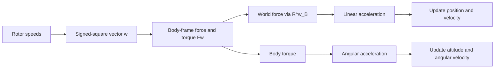
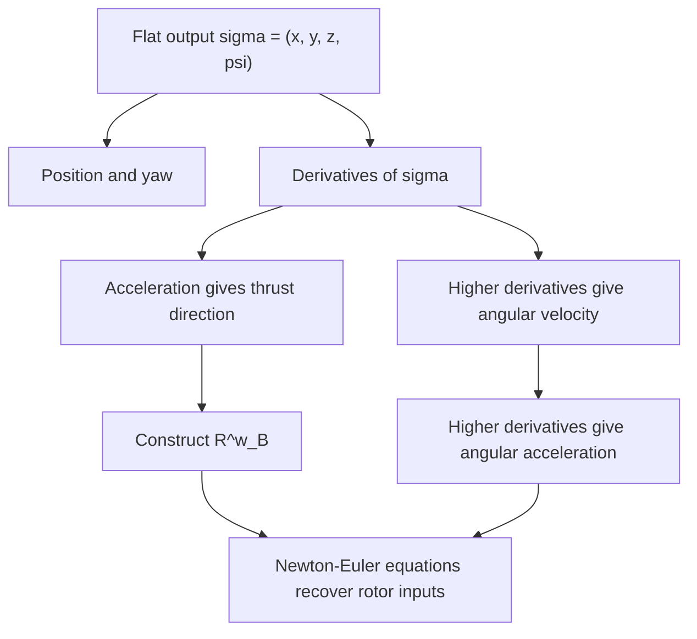

# Lecture 6 - Quadrotor Model

_MIT 16.485 Visual Navigation for Autonomous Vehicles study report based on the Lecture 6 notes._

---

## Overview

This lecture builds a dynamical model for a quadrotor from first principles. The model starts with the Newton-Euler equations for a rigid body, then specializes the external forces and torques to the forces produced by four spinning rotors. The lecture also proves the standard derivative formula for a rotation matrix and introduces the differential flatness property that makes quadrotor trajectory generation tractable.

The central idea is that a quadrotor has only four direct control inputs, the four rotor speeds, but its motion lives in a larger state space containing position, velocity, attitude, and angular velocity. The dynamics explain how those four rotor inputs produce translational acceleration, rotational acceleration, and attitude evolution.

> [!summary]
> A quadrotor is controlled indirectly: rotor speeds produce thrust and torque, thrust and torque produce acceleration, and acceleration evolves the full rigid-body state.

The lecture has four main pieces:

| Theme                         | Main question                                             | Why it matters                                             |
| ----------------------------- | --------------------------------------------------------- | ---------------------------------------------------------- |
| Newton-Euler dynamics         | How do forces and torques move a rigid body?              | Provides the physics backbone of the quadrotor model       |
| Rotor force and torque models | How do spinning propellers create thrust and drag torque? | Connects motor commands to body motion                     |
| Rotation matrix derivative    | Why is $\dot{R} = R[\omega]^\wedge$?                      | Needed to write attitude dynamics as first-order equations |
| Differential flatness         | Can state and inputs be recovered from simpler outputs?   | Enables smooth trajectory generation from $(x,y,z,\psi)$   |

## Frames, variables, and modeling viewpoint

The lecture uses a world frame $w$, a body frame $B$, and propeller frames $P_i$. The body frame is attached to the quadrotor. The world frame is fixed in the environment. Each propeller frame is attached to a rotor.

| ![[attachments/lecture-6-quadrotor-variables.png]] |
| :---: |
| Figure 6.1: Quadrotor variables, including world/body axes, rotor thrust, drag torque, and rotor position. |

Important state variables:

| Symbol                          | Meaning                                                                      |
| ------------------------------- | ---------------------------------------------------------------------------- |
| $p^w \in \mathbb{R}^3$          | Position of the quadrotor center of mass in the world frame                  |
| $v^w \in \mathbb{R}^3$          | Linear velocity in the world frame                                           |
| $a^w \in \mathbb{R}^3$          | Linear acceleration in the world frame                                       |
| $R^w_B \in SO(3)$               | Rotation matrix whose columns are the body axes expressed in the world frame |
| $\omega^B \in \mathbb{R}^3$     | Angular velocity expressed in the body frame                                 |
| $\alpha^B \in \mathbb{R}^3$     | Angular acceleration expressed in the body frame                             |
| $J \in \mathbb{R}^{3 \times 3}$ | Inertia matrix about the center of mass                                      |
| $m \in \mathbb{R}_+$            | Quadrotor mass                                                               |

The control inputs are the rotor angular velocities. The lecture packs them into a signed-square vector:

$$
w =
\begin{bmatrix}
w_1 |w_1| &
w_2 |w_2| &
w_3 |w_3| &
w_4 |w_4|
\end{bmatrix}^T
$$

This form matters because ideal rotor thrust scales with the square of rotor speed, while the sign captures spin direction.

> [!warning]
> Do not confuse the world frame superscript with a power. In expressions such as $p^w$ or $R^w_B$, the superscript indicates the coordinate frame in which the quantity is expressed.

## Newton-Euler dynamics

The Newton-Euler equation combines translational and rotational rigid-body dynamics:

$$
\begin{bmatrix}
f^w \\
\tau^B
\end{bmatrix}
=
\begin{bmatrix}
mI_3 & 0 \\
0 & J
\end{bmatrix}
\begin{bmatrix}
a^w \\
\alpha^B
\end{bmatrix}
+
\begin{bmatrix}
0 \\
\omega^B \times J\omega^B
\end{bmatrix}
$$

The translational part is the familiar $f = ma$. The rotational part is less direct because the torque is expressed in the rotating body frame. The extra gyroscopic term,

$$
\omega^B \times J\omega^B
$$

appears because angular momentum is being differentiated in a rotating coordinate frame.

Gravity is modeled explicitly. With the world $z$ axis pointing upward, gravity is

$$
g^w = -g e_3,
\qquad
e_3 =
\begin{bmatrix}
0 \\
0 \\
1
\end{bmatrix}
$$

Moving gravity to the right-hand side gives

$$
\begin{bmatrix}
f^w \\
\tau^B
\end{bmatrix}
=
\begin{bmatrix}
mI_3 & 0 \\
0 & J
\end{bmatrix}
\begin{bmatrix}
a^w \\
\alpha^B
\end{bmatrix}
+
\begin{bmatrix}
-mg^w \\
\omega^B \times J\omega^B
\end{bmatrix}
$$

> [!tip]
> A useful mental split is: translational dynamics live naturally in the world frame, while rotational torques and angular velocity are often simpler in the body frame.

## Aerodynamic forces and torques

The lecture distinguishes the dominant rotor effects from smaller aerodynamic effects. At low speed, roughly below $10\,\mathrm{m/s}$, thrust and rotor drag dominate. Hub force, hub moment, rolling moment, and ground effect are treated as smaller effects and neglected for the basic model.

### Thrust force

For rotor $i$, the thrust force in propeller frame $P_i$ is modeled as

$$
T^{P_i}_i = c_f w_i |w_i| e_3
$$

where $c_f$ is a constant coefficient, maps signed squared rotor speed to thrust magnitude. The direction is the vertical axis of the propeller frame.

The total thrust force in the body frame is

$$
f^B_{\mathrm{thrust}}
=
\sum_{i=1}^{4} R^B_{P_i} T^{P_i}_i
$$

For a standard quadrotor, the propeller frames are usually aligned with the body frame, so $R^B_{P_i} = I_3$. In that common case, each rotor contributes thrust along the body $z$ direction.

### Rotor drag torque

Each spinning propeller also creates a drag torque. The lecture models rotor $i$ as

$$
\tau^{P_i}_{\mathrm{drag},i}
=
(-1)^{i+1} c_d w_i |w_i| e_3
$$

The alternating sign appears because neighboring propellers spin in opposite directions. This is how the quadrotor can generate yaw torque without requiring all rotors to spin in the same direction.

The total drag torque in the body frame is

$$
\tau^B_{\mathrm{drag}}
=
\sum_{i=1}^{4} R^B_{P_i} \tau^{P_i}_{\mathrm{drag},i}
$$

### Thrust torque

A rotor also produces torque because its thrust is applied away from the center of mass. If $\rho^B_i$ is the vector from the center of mass to rotor $i$, then the torque contribution is a moment arm crossed with force:

$$
\tau^B_{\mathrm{thrust}}
=
\sum_{i=1}^{4}
\left(
\rho^B_i \times R^B_{P_i} T^{P_i}_i
\right)
$$

The total torque is

$$
\tau^B
=
\tau^B_{\mathrm{drag}}
+
\tau^B_{\mathrm{thrust}}
$$

> [!info]
> Rotor thrust mostly controls vertical acceleration and roll/pitch torques. Alternating rotor drag torques are what make yaw control possible.

## Compact force-torque input model

The lecture groups all non-gravitational force and torque terms into one matrix mapping from rotor signed-square speeds to a wrench-like vector:

$$
\begin{bmatrix}
f^B_x \\
f^B_y \\
f^B_z \\
\tau^B_x \\
\tau^B_y \\
\tau^B_z
\end{bmatrix}
=
F w
$$

Under the standard assumption $R^B_{P_i} = I_3$, the columns of $F$ encode each rotor's contribution:

$$
F =
\begin{bmatrix}
c_f e_3 & c_f e_3 & c_f e_3 & c_f e_3 \\
c_d e_3 + c_f \rho^B_1 \times e_3 &
-c_d e_3 + c_f \rho^B_2 \times e_3 &
c_d e_3 + c_f \rho^B_3 \times e_3 &
-c_d e_3 + c_f \rho^B_4 \times e_3
\end{bmatrix}
$$

This expression is compact but conceptually simple:

1. The top block maps rotor speeds to body-frame force.
2. The bottom block maps rotor speeds to body-frame torque.
3. The torque block includes both yaw drag torque and moment-arm torque.

The dynamics can then be written as

$$
\begin{bmatrix}
m a^w \\
J \alpha^B
\end{bmatrix}
=
\begin{bmatrix}
-mg e_3 \\
-\omega^B \times J\omega^B
\end{bmatrix}
+
\begin{bmatrix}
R^w_B & 0 \\
0 & I_3
\end{bmatrix}
F w
$$

The rotation matrix $R^w_B$ appears only in the force part because thrust is generated in the body frame but acceleration is expressed in the world frame.

## First-order quadrotor dynamics

The final model is written as a system of first-order differential equations. The state is

$$
\left(p^w, v^w, R^w_B, \omega^B\right)
$$

and the controls are the four rotor velocities summarized in $w$.

The translational and rotational acceleration equations are

$$
\begin{bmatrix}
m\dot{v}^w \\
J\dot{\omega}^B
\end{bmatrix}
=
\begin{bmatrix}
-mg e_3 \\
-\omega^B \times J\omega^B
\end{bmatrix}
+
\begin{bmatrix}
R^w_B & 0 \\
0 & I_3
\end{bmatrix}
F w
$$

The kinematic equations are

$$
\dot{p}^w = v^w
$$

$$
\dot{R}^w_B = R^w_B [\omega^B]^\wedge
$$

Together, these equations describe how the quadrotor evolves over time.

> [!summary]
> The dynamical part computes accelerations from force and torque. The kinematic part integrates those accelerations into velocity, position, attitude, and angular velocity.

## Derivative of the rotation matrix

The rotation derivative formula is the bridge between angular velocity and attitude evolution. It is also a direct application of the Lie group ideas from [[Lecture 4 - Lie Groups]].

Start from the orthogonality condition:

$$
R^w_B(t)\left(R^w_B(t)\right)^T = I_3
$$

Differentiate with respect to time:

$$
\dot{R}^w_B(t)\left(R^w_B(t)\right)^T
+
R^w_B(t)\left(\dot{R}^w_B(t)\right)^T
= 0
$$

Define

$$
S(t) =
\dot{R}^w_B(t)\left(R^w_B(t)\right)^T
$$

Then the differentiated orthogonality condition implies

$$
S(t) + S(t)^T = 0
$$

so $S(t)$ is skew-symmetric. Because every $3 \times 3$ skew-symmetric matrix can be written as the hat form of a vector, there exists an angular velocity vector $\omega^w(t)$ such that

$$
S(t) = [\omega^w(t)]^\wedge
$$

Postmultiplying the definition of $S(t)$ by $R^w_B(t)$ gives

$$
\dot{R}^w_B(t)
=
[\omega^w(t)]^\wedge R^w_B(t)
$$

This is the world-frame angular velocity version. The lecture then converts it to body-frame angular velocity. Since

$$
\omega^B(t) = \left(R^w_B(t)\right)^T \omega^w(t)
$$

and

$$
[a]^\wedge R = R[R^T a]^\wedge
$$

we obtain

$$
\dot{R}^w_B(t)
=
R^w_B(t)[\omega^B(t)]^\wedge
$$

> [!warning]
> The side where the hat matrix appears depends on the frame of the angular velocity. World-frame angular velocity gives $[\omega^w]^\wedge R$, while body-frame angular velocity gives $R[\omega^B]^\wedge$.

## Differential flatness

A system is differentially flat if all states and control inputs can be written as algebraic functions of a smaller set of outputs and their derivatives. If $y$ is a flat output, then there are smooth functions $g_x$ and $g_u$ such that

$$
x = g_x(y, \dot{y}, \ddot{y}, \ldots)
$$

and

$$
u = g_u(y, \dot{y}, \ddot{y}, \ldots)
$$

For the quadrotor, the lecture uses the flat output

$$
\sigma =
\begin{bmatrix}
\sigma_1 \\
\sigma_2 \\
\sigma_3 \\
\sigma_4
\end{bmatrix}
=
\begin{bmatrix}
x \\
y \\
z \\
\psi
\end{bmatrix}
$$

where $(x,y,z)$ are the world-frame position coordinates and $\psi$ is yaw.

This means a trajectory can be planned as a smooth curve

$$
\sigma(t): [t_0, t_m] \rightarrow \mathbb{R}^3 \times SO(2)
$$

and the full state and inputs can be recovered from $\sigma$ and its derivatives.

> [!tip]
> Flatness turns the hard trajectory design problem into a simpler output-space design problem. Instead of directly planning every state and input, we plan $(x,y,z,\psi)$ smoothly and recover the rest.

## Recovering state from flat outputs

### Position and velocity

Position and velocity are immediate:

$$
p^w =
\begin{bmatrix}
\sigma_1 \\
\sigma_2 \\
\sigma_3
\end{bmatrix},
\qquad
v^w =
\begin{bmatrix}
\dot{\sigma}_1 \\
\dot{\sigma}_2 \\
\dot{\sigma}_3
\end{bmatrix}
$$

### Body z-axis from desired acceleration

The translational equation can be rearranged into

$$
m a^w = -mg e_3 + f z^w_B
$$

where $z^w_B$ is the body $z$ axis expressed in the world frame and $f$ is the total thrust magnitude. Rearranging:

$$
z^w_B =
\frac{m}{f}
\left(a^w + g e_3\right)
$$

Since $z^w_B$ must be a unit vector, the scale is not needed for the direction. Define

$$
v =
\begin{bmatrix}
\ddot{\sigma}_1 \\
\ddot{\sigma}_2 \\
\ddot{\sigma}_3 + g
\end{bmatrix}
$$

Then

$$
z^w_B = \frac{v}{\|v\|}
$$

This is a key geometric result: desired acceleration determines where the quadrotor's thrust axis must point.

### Completing the rotation matrix using yaw

The flat output also gives yaw:

$$
\sigma_4 = \psi
$$

From yaw, define an auxiliary heading vector with no roll or pitch:

$$
\tilde{x}^w_B =
\begin{bmatrix}
\cos(\sigma_4) \\
\sin(\sigma_4) \\
0
\end{bmatrix}
$$

Then construct the body axes:

$$
y^w_B =
\frac{
z^w_B \times \tilde{x}^w_B
}{
\|z^w_B \times \tilde{x}^w_B\|
}
$$

$$
x^w_B = y^w_B \times z^w_B
$$

Finally,

$$
R^w_B =
\begin{bmatrix}
x^w_B & y^w_B & z^w_B
\end{bmatrix}
$$

| ![[attachments/lecture-6-flatness-frames.png]] |
| :---: |
| Figure 6.2: Constructing quadrotor body axes from the thrust direction and yaw during the flatness proof. |

> [!warning]
> This construction fails when $z^w_B$ is parallel to $\tilde{x}^w_B$, because the cross product used to compute $y^w_B$ becomes zero.

### Angular velocity from higher derivatives

To recover angular velocity, differentiate the translational equation:

$$
\frac{d}{dt}(m a^w)
=
\frac{d}{dt}(-mg e_3 + u_1 z^w_B)
$$

Since gravity is constant:

$$
m\dot{a}^w
=
\dot{u}_1 z^w_B + \omega^w \times u_1 z^w_B
$$

Projecting onto $z^w_B$ isolates $\dot{u}_1$ because the cross product term is perpendicular to $z^w_B$. Substituting back gives a vector in the plane perpendicular to $z^w_B$:

$$
h_\omega =
\omega^w \times z^w_B
=
\frac{m}{u_1}
\left(
\dot{a}^w - (z^w_B \cdot \dot{a}^w) z^w_B
\right)
$$

If

$$
\omega^w = p x^w_B + q y^w_B + r z^w_B
$$

then the components are

$$
p = -h_\omega \cdot y^w_B,
\qquad
q = h_\omega \cdot x^w_B,
\qquad
r = \dot{\psi} e_3 \cdot z^w_B
$$

These relationships show why derivatives of the flat output beyond acceleration are needed. Acceleration determines thrust direction; jerk helps determine angular velocity; still higher derivatives are involved when recovering angular acceleration and rotor inputs.

## Recovering control inputs

Once position, velocity, attitude, angular velocity, linear acceleration, and angular acceleration are expressible from the flat outputs and their derivatives, the Newton-Euler equations can be inverted to recover the controls.

Conceptually:

1. Use $\sigma$, $\dot{\sigma}$, and $\ddot{\sigma}$ to recover $p^w$, $v^w$, and $R^w_B$.
2. Use higher derivatives such as jerk to recover $\omega^B$.
3. Use still higher derivatives to recover $\dot{\omega}^B$.
4. Use the force-torque equation to solve for the rotor signed-square speeds $w$.
5. Convert signed-square values back to rotor angular velocities when physically valid.

This is why the lecture states that the state and input can be written as algebraic functions of $\sigma$ and its derivatives.

## Key terms

| Term | Definition |
| --- | --- |
| Newton-Euler equations | Rigid-body dynamics combining translational force balance and rotational torque balance |
| Thrust force | Force generated by a rotor, approximately proportional to signed squared rotor speed |
| Rotor drag torque | Torque caused by aerodynamic drag on a spinning rotor, with direction depending on spin direction |
| Moment arm | Vector from the center of mass to where a force is applied |
| Inertia matrix | Matrix describing resistance to angular acceleration around body axes |
| Hat operator | Map from a 3-vector to a skew-symmetric matrix, used to represent cross products |
| Differential flatness | Property that state and inputs can be reconstructed from selected outputs and their derivatives |
| Flat output | Output vector from which the full state and control inputs can be algebraically recovered |
| Underactuated system | System with fewer direct control inputs than state degrees of freedom |
| Yaw angle | Rotation about the world vertical direction, used as the fourth quadrotor flat output |

## Connections to earlier and later material

The rotation derivative section connects directly to [[Lecture 4 - Lie Groups]]. The equation

$$
\dot{R}^w_B = R^w_B[\omega^B]^\wedge
$$

is an example of using the tangent space of $SO(3)$ to describe motion on the rotation manifold.

The flatness result is important for trajectory generation and control. Later planning methods can design smooth curves for $(x,y,z,\psi)$, then use the flatness map to compute desired attitude, thrust, angular velocity, and rotor commands.

The force-torque model also prepares for practical control design. A real controller usually compares the desired state to the estimated state, computes desired thrust and torque, and maps them through a mixer to rotor commands.

## Study checklist

- Explain why the rotational Newton-Euler equation contains $\omega^B \times J\omega^B$.
- Derive the difference between thrust force, rotor drag torque, and thrust torque.
- State why $R^w_B$ appears in the translational force equation but not in the body-frame torque equation.
- Prove why $\dot{R}^w_B = R^w_B[\omega^B]^\wedge$ when angular velocity is expressed in the body frame.
- Explain why desired acceleration determines the body $z$ axis.
- Reconstruct $R^w_B$ from $z^w_B$ and yaw $\psi$.
- Describe the singularity in the flatness construction.
- Explain why differential flatness is useful for trajectory generation.

## References from the lecture

1. Ilan Kroo, Fritz Prinz, Michael Shantz, Peter Kunz, Gary Fay, Shelley Cheng, Tibor Fabian, and Chad Partridge. _The mesicopter: A miniature rotorcraft concept phase ii interim report_. Stanford University, 2000.
2. Daniel Mellinger and Vijay Kumar. "Minimum snap trajectory generation and control for quadrotors." _IEEE International Conference on Robotics and Automation_, 2011.
