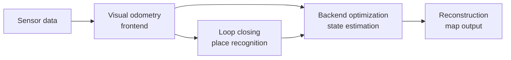

# Chapter 1 - Introduction to SLAM

## Overview

This chapter introduces visual SLAM as the combined problem of **localization** and **map building** in an unknown environment. The book frames the topic through the robot "Little Carrot": if a robot is expected to move autonomously, it must estimate where it is and what the surrounding world looks like. Visual SLAM tries to solve both problems using camera images, usually without modifying the environment.

The chapter also gives the classical SLAM system layout: sensor data enters a **frontend** visual odometry module, is refined by a **backend** optimizer, corrected by **loop closing**, and finally used for **mapping/reconstruction**.

> [!summary]
> SLAM is not one algorithm. It is a system of cooperating modules that turn noisy sensor streams into a consistent estimate of camera trajectory and environment structure.

## Why SLAM Is Needed

A mobile robot cannot act intelligently if it only moves blindly. It needs two forms of perception:

- **Inward perception:** estimating its own pose, called localization.
- **Outward perception:** estimating the surrounding environment, called mapping.

The difficulty is that both are coupled. A robot needs a map to localize, but it needs poses to build the map. SLAM solves this circular problem by estimating the trajectory and map together.

## Intrusive and Non-Intrusive Sensors

The chapter separates localization aids into two broad categories.

**Intrusive sensors** rely on changes to the environment. Examples include guide rails, QR-code markers, and prepared localization infrastructure. They can be reliable, but they only work where the environment has been prepared.

**Non-intrusive sensors** are carried on the robot and do not require environmental modification. Examples include cameras, laser scanners, wheel encoders, and IMUs. These sensors usually do not directly measure global position, so algorithms must infer pose from indirect observations.

| ![[attachments/slambook-first5/chapter-1-sensor-types.png]] |
| :---------------------------------------------------------: |
| Examples of intrusive and non-intrusive sensors used around SLAM problems |

> [!tip]
> In SLAM, "unknown environment" is the key phrase. If the environment must be prepared in advance, the solution is often useful, but it is no longer the general SLAM problem this book focuses on.

## Camera Types in Visual SLAM

| ![[attachments/slambook-first5/chapter-1-camera-types.png]] |
| :---------------------------------------------------------: |
| Monocular, RGB-D, and stereo camera examples |

### Monocular Camera

A monocular camera has one lens and produces ordinary 2D images. It is cheap and simple, which makes monocular SLAM attractive. Its main weakness is that a single image loses depth.

If a 3D point projects to a pixel, all points along the corresponding ray could have produced that same pixel. Depth can be inferred only by moving the camera and observing how image content changes.

> [!warning]
> Monocular SLAM has **scale ambiguity**. If both the camera trajectory and the scene structure are scaled by the same factor, the image sequence can look unchanged. Pure monocular vision cannot determine the absolute metric scale by itself.

### Stereo Camera

A stereo camera uses two synchronized cameras with a known baseline. Depth can be estimated from disparity between the left and right images. Larger disparity means the point is closer.

Stereo avoids the monocular scale ambiguity because the physical baseline provides a real metric length. Its cost is more complex calibration and heavier computation for matching pixels across the two views.

### RGB-D Camera

An RGB-D camera directly measures depth using active sensing, commonly structured light or time-of-flight. It provides both color and depth images, making it convenient for indoor mapping and point cloud construction.

Its limitations include restricted range, sensitivity to sunlight or interference, problems with transparent/reflective objects, and higher power consumption.

## Classical Visual SLAM Framework

| ![[attachments/slambook-first5/chapter-1-classical-framework.png]] |
| :----------------------------------------------------------------: |
| Classical visual SLAM framework |

The classical framework contains five main parts.

1. **Sensor data acquisition:** obtains camera images and, when available, synchronized encoder, IMU, or other sensor data.
2. **Visual odometry:** estimates camera motion between nearby frames and builds a rough local map.
3. **Backend optimization/filtering:** refines poses and map structure by accounting for noise and uncertainty.
4. **Loop closing:** detects when the robot revisits a known place and adds a correction constraint.
5. **Reconstruction/mapping:** builds a map whose form depends on the application.

## Visual Odometry

Visual odometry estimates the motion of the camera between adjacent frames. It is called "odometry" because it accumulates local motion estimates, much like wheel odometry.

The frontend usually answers questions like:

- Which image features or pixels correspond across frames?
- What camera motion explains those correspondences?
- What local 3D structure can be inferred?

However, because each small motion estimate contains error, chaining them over time causes drift. Even a tiny angular error can permanently bias later pose estimates.

| ![[attachments/slambook-first5/chapter-1-vo-drift-loop-closure.png]] |
| :-----------------------------------------------------------------: |
| Accumulated visual odometry drift and the role of loop closure |

> [!warning]
> Visual odometry alone is local. It can produce a plausible trajectory for a while, but without global correction its error accumulates.

## Backend Optimization

The backend receives noisy pose and map information and estimates the most consistent global state. It is less concerned with raw images and more concerned with variables, residuals, uncertainty, and constraints.

The frontend is closer to computer vision: image features, matching, tracking, and geometry. The backend is closer to state estimation: probability, covariance, least squares, filtering, and nonlinear optimization.

This idea connects directly to [[Chapter 5 - Nonlinear Optimization]], where noisy motion and observation equations are turned into least-squares problems.

## Loop Closing

Loop closing detects when the robot returns to a previously visited place. If the robot recognizes a place, it can add a constraint saying that two estimated poses should correspond to the same physical area.

This is what helps remove long-term drift. The frontend may gradually distort a corridor or room layout, but a loop constraint gives the backend a reason to bend the trajectory back into global consistency.

> [!info]
> In visual SLAM, loop closing often becomes an image similarity problem: decide whether two images came from the same place despite viewpoint, lighting, and time differences.

## Mapping

The chapter emphasizes that "map" does not have a single fixed meaning. The map should serve the task.

| ![[attachments/slambook-first5/chapter-1-map-types.png]] |
| :-----------------------------------------------------: |
| Different map forms: metric grids, topological maps, point clouds, and meshes |

**Metric maps** store geometric positions. They can be sparse or dense:

- A **sparse metric map** keeps selected landmarks, enough for localization.
- A **dense metric map** models occupied/free/unknown space more completely, useful for navigation and obstacle avoidance.

**Topological maps** store connectivity rather than exact geometry. A topological map may only say that location A connects to location B, without preserving precise distance or shape.

> [!tip]
> Use sparse maps when localization is the priority. Use dense maps when a robot must plan collision-free motion through space.

## Mathematical Formulation of SLAM

The chapter introduces the abstract SLAM model with discrete time steps. Let:

- $x_k$ be the robot pose at time $k$.
- $u_k$ be the control input.
- $w_k$ be motion noise.
- $y_j$ be landmark $j$.
- $z_{k,j}$ be the observation of landmark $j$ from pose $x_k$.
- $v_{k,j}$ be observation noise.

The motion model is:

$$
x_k = f(x_{k-1}, u_k, w_k)
$$

The observation model is:

$$
z_{k,j} = h(y_j, x_k, v_{k,j})
$$

In many later derivations, the noise is written additively:

$$
x_k = f(x_{k-1}, u_k) + w_k
$$

$$
z_{k,j} = h(y_j, x_k) + v_{k,j}
$$

The full SLAM problem is to estimate:

$$
x_{1:k}, \; y_{1:N}
$$

from all controls and observations:

$$
u_{1:k}, \; z_{1:k}
$$

## Step-by-Step: How the SLAM System Thinks

1. The robot receives a new image.
2. The frontend compares it with recent images and estimates relative camera motion.
3. Local map points are updated or created.
4. The backend treats poses, map points, and constraints as a state estimation problem.
5. Loop closing checks whether the current place has been seen before.
6. If a loop is found, the backend adds a global correction constraint.
7. The map is produced in the form needed by the application.

## Key Terms

**SLAM:** Simultaneous Localization and Mapping; estimating robot trajectory and environment map at the same time.

**Localization:** Estimating the robot or camera pose.

**Mapping:** Building a representation of the environment.

**Visual odometry:** Estimating camera motion from nearby image frames.

**Frontend:** The image-processing and local-motion part of SLAM.

**Backend:** The state-estimation and optimization part of SLAM.

**Loop closing:** Detecting revisited places to reduce accumulated drift.

**Scale ambiguity:** The inability of pure monocular vision to recover absolute metric scale from images alone.

**Metric map:** A map that preserves geometric measurements.

**Topological map:** A map that emphasizes connectivity rather than exact geometry.

## Connections to Later Chapters

The pose variables $x_k$ require a mathematical representation of 3D motion, which is introduced in [[Chapter 2 - 3D Rigid Body Motion]].

The pose update and optimization problem becomes easier with Lie groups and Lie algebras, introduced in [[Chapter 3 - Lie Group and Lie Algebra]].

The observation function $h(\cdot)$ becomes concrete when the camera projection model is introduced in [[Chapter 4 - Cameras and Images]].

The backend estimation problem becomes a nonlinear least-squares problem in [[Chapter 5 - Nonlinear Optimization]].

The frontend is expanded into feature-based visual odometry in [[Chapter 6 - Visual Odometry Part I]] and direct visual odometry in [[Chapter 7 - Visual Odometry Part II]].

The backend is expanded into bundle adjustment, sliding windows, and pose graphs in [[Chapter 8 - Filters and Optimization Approaches Part I]] and [[Chapter 9 - Filters and Optimization Approaches Part II]].

Loop closing is developed in [[Chapter 10 - Loop Closure]], and richer map forms are discussed in [[Chapter 11 - Dense Reconstruction]].

The full system-engineering view appears in [[Chapter 12 - Practice Stereo Visual Odometry]], while [[Chapter 13 - Discussions and Outlook]] compares complete open-source SLAM systems.

> [!summary]
> Chapter 1 gives the map of the book: cameras produce observations, geometry turns observations into constraints, optimization refines poses and map points, and loop closing repairs long-term drift.
