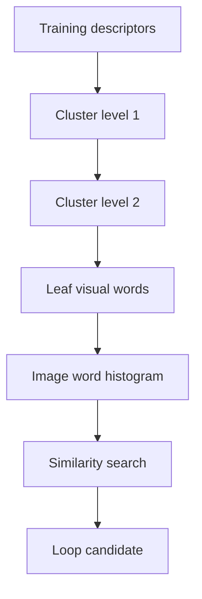

# Chapter 10 - Loop Closure

## Overview

Chapter 10 introduces loop closure, the module that detects when the camera has returned to a previously visited place. Visual odometry and local backend optimization can produce good short-term estimates, but their errors accumulate over long trajectories. Loop closure adds long-range constraints that allow the backend to correct drift.

This chapter focuses on appearance-based loop detection using the bag-of-words model.

> [!summary]
> Loop closure converts "this place looks familiar" into a geometric constraint that can pull a drifting trajectory back into global consistency.

## Why Loop Closure Is Needed

If a pose graph only contains adjacent constraints, drift accumulates along the path. Even if each local estimate is good, small errors compound.

| ![[attachments/slambook-ch6-13/chapter-10-loop-drift.png]] |
| :-------------------------------------------------------: |
| Loop closure adds long-range constraints that reduce accumulated drift |

When the robot revisits a location, the loop closure module can add an edge between two distant keyframes:

$$
T_{ij}
$$

This edge says that keyframes $i$ and $j$ are related by an observed relative pose. In the pose graph from [[Chapter 9 - Filters and Optimization Approaches Part II#Pose Graph Optimization]], this becomes an additional constraint.

> [!info]
> A system with frontend and local backend is often called visual odometry. A system with loop closure and global correction deserves the stronger name SLAM.

## How to Detect Loops

The chapter discusses several approaches:

- Match every image pair, which is accurate but $O(N^2)$ and too expensive.
- Randomly compare historical frames, which is cheap but unreliable for long sequences.
- Use odometry proximity, which can fail when drift is large.
- Use appearance similarity, which is independent of the current pose estimate.

Appearance-based loop detection is widely used because it can find loops even when odometry has drifted far away.

## Precision and Recall

Loop detection is a classification problem. A candidate can be:

- **True positive:** detected as loop and really is a loop.
- **False positive:** detected as loop but is not a loop.
- **False negative:** not detected, but really is a loop.
- **True negative:** correctly rejected.

Precision is:

$$
\text{Precision}
=
\frac{TP}{TP+FP}
$$

Recall is:

$$
\text{Recall}
=
\frac{TP}{TP+FN}
$$

In SLAM, false positives are much more dangerous than false negatives. A missed loop leaves some drift. A false loop can create a wrong pose-graph edge and destroy the map.

| ![[attachments/slambook-ch6-13/chapter-10-precision-recall.png]] |
| :-------------------------------------------------------------: |
| Precision-recall curve illustrates the trade-off between strict and loose loop detection |

> [!warning]
> For loop closure, high precision is usually more important than high recall. A wrong loop edge is a structural lie inside the backend.

## Perceptual Aliasing and Perceptual Variability

**Perceptual aliasing** means different places look similar. Repeated corridors, desks, shelves, or building facades can cause false positives.

**Perceptual variability** means the same place looks different. Lighting changes, viewpoint changes, moving objects, and seasonal changes can cause false negatives.

The loop closure system must balance both risks.

## Bag of Words

Bag of Words, or BoW, represents an image by the visual words it contains. Instead of comparing raw pixels, the system compares histograms of visual feature types.

If the dictionary has words $w_1,w_2,w_3$, an image might be represented as:

$$
A = 1w_1 + 1w_2 + 0w_3
$$

or as the vector:

$$
A =
\begin{bmatrix}
1 \\
1 \\
0
\end{bmatrix}
$$

Similarity can then be computed between vectors. One simple score is:

$$
s(a,b)=1-\frac{1}{W}\lVert a-b\rVert_1
$$

where $W$ is the dictionary size.

> [!tip]
> Bag of Words ignores the order of visual words. That makes it more tolerant to viewpoint changes, but it also loses spatial arrangement information.

## Training the Dictionary

The dictionary is learned from many feature descriptors. Since similar descriptors should belong to the same visual word, dictionary training is a clustering problem.

The chapter introduces K-means and hierarchical K-means. Hierarchical structure is important because a flat dictionary with many words can be expensive to search.
If the dictionary is sorted, then the binary search can improve search efficiency and reach the logarithmic level of complexity.

| ![[attachments/slambook-ch6-13/chapter-10-bow-dictionary.png]] |
| :-----------------------------------------------------------: |
| Hierarchical visual dictionary used for efficient bag-of-words image description |

| ![[attachments/slambook-ch6-13/chapter-10-demo-images.png]] |
| :--------------------------------------------------------: |
| Example images used for the loop-closure bag-of-words demonstration |

The hierarchical vocabulary works like a tree:

1. Start with many training descriptors.
2. Cluster them into $k$ groups.
3. Recursively cluster each group.
4. Treat leaf nodes as visual words.

## From Candidate to Constraint

A high BoW similarity score is only a loop candidate. A practical system should verify it geometrically before adding a backend edge.

Common checks include:

- Feature matching between the candidate frames.
- PnP or essential-matrix estimation with RANSAC.
- Consistency with neighboring keyframes.
- A minimum inlier count.

This connects back to [[Chapter 6 - Visual Odometry Part I]], where feature matches become geometric pose estimates.

## Key Terms

**Loop closure:** Detecting that the camera has returned to a previous place and adding a correction constraint.

**Place recognition:** Image-based recognition of previously visited scenes.

**Precision:** Fraction of detected loops that are correct.

**Recall:** Fraction of real loops that are detected.

**Perceptual aliasing:** Different places look similar.

**Perceptual variability:** The same place looks different.

**Bag of Words:** Image representation based on counts or weights of visual words.

**Visual dictionary:** Set of clustered feature descriptors used as words.

**DBoW:** A library family for bag-of-words loop detection.

## Connections

Loop closure creates long-range pose graph edges for [[Chapter 9 - Filters and Optimization Approaches Part II#Pose Graph Optimization]].

BoW uses image descriptors from the feature method in [[Chapter 6 - Visual Odometry Part I#ORB Features]].

Relocalization extends the map-use idea from [[Chapter 1 - Introduction to SLAM#Loop Closing]].

ORB-SLAM's use of an ORB dictionary is discussed again in [[Chapter 13 - Discussions and Outlook#ORB-SLAM Series]].

> [!summary]
> Chapter 10 explains the global correction mechanism in SLAM: recognize old places carefully, verify them geometrically, and add constraints that remove long-term drift.
