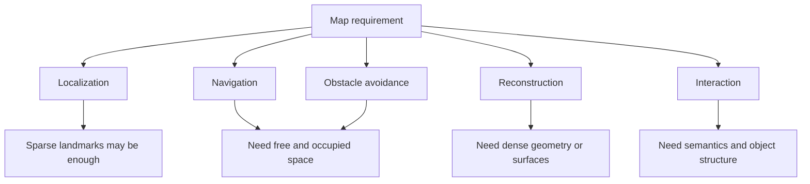

# Chapter 11 - Dense Reconstruction

## Overview

Chapter 11 turns from localization to mapping. Earlier chapters used sparse landmarks mostly because they were enough for pose estimation. Real applications often need richer maps for navigation, obstacle avoidance, interaction, and visualization.

This chapter studies monocular dense reconstruction, RGB-D point cloud mapping, octo-maps, and TSDF fusion.

> [!summary]
> Sparse maps are often enough to localize a camera. Dense maps are needed when the system must understand occupied space, surfaces, or object-level interaction.

## Why Sparse Feature Maps Are Not Enough

Sparse feature maps work for localization because the camera only needs recognizable landmarks. But they are poor for:

- **Navigation:** the robot must know free and occupied space.
- **Obstacle avoidance:** local dense geometry is needed.
- **Reconstruction:** users expect continuous surfaces, not isolated points.
- **Interaction:** AR and robotics often need surfaces, objects, and semantic regions.

This expands the map discussion from [[Chapter 1 - Introduction to SLAM#Mapping]].

| ![[attachments/slambook-ch6-13/chapter-11-map-types.png]] |
| :------------------------------------------------------: |
| Different map forms support localization, navigation, reconstruction, and interaction |

## Monocular Dense Reconstruction

A monocular camera does not directly measure depth. Dense reconstruction must estimate depth from motion, similar to triangulation in [[Chapter 6 - Visual Odometry Part I#Triangulation]], but now for many pixels instead of selected features.

Possible depth sources are:

- Moving monocular camera with known trajectory.
- Stereo camera disparity.
- RGB-D camera depth measurements.

The chapter first studies monocular depth estimation using epipolar line search and depth filtering.

## Epipolar Line Search

If a pixel $p_1$ in the reference image has unknown depth, its possible 3D points lie along a camera ray. In another view, that ray projects to an epipolar line.

| ![[attachments/slambook-ch6-13/chapter-11-epipolar-depth.png]] |
| :-----------------------------------------------------------: |
| Epipolar search restricts the matching problem to a line in the second image |

Instead of searching the whole image, the algorithm searches along this epipolar line for a matching patch.

## Block Matching

A single pixel intensity is not distinctive enough, so the chapter compares small image blocks. Common similarity measures include:

SAD:

$$
S(A,B)_{\text{SAD}}
=
\sum_{i,j}|A(i,j)-B(i,j)|
$$

SSD:

$$
S(A,B)_{\text{SSD}}
=
\sum_{i,j}(A(i,j)-B(i,j))^2
$$

NCC:

$$
S(A,B)_{\text{NCC}}
=
\frac{
\sum_{i,j}A(i,j)B(i,j)
}{
\sqrt{
\sum_{i,j}A(i,j)^2
\sum_{i,j}B(i,j)^2
}
}
$$

SAD and SSD are distances, so smaller is better. NCC is a correlation, so larger is better.

> [!warning]
> Block matching has a stronger assumption than single-pixel brightness constancy: it assumes a whole local patch stays comparable across views.

## Gaussian Depth Filter

The chapter models each pixel depth as a Gaussian:

$$
P(d)=\mathcal{N}(\mu,\sigma^2)
$$

Each new observation gives:

$$
P(d_{\text{obs}})
=
\mathcal{N}(\mu_{\text{obs}},\sigma_{\text{obs}}^2)
$$

The fused estimate is also Gaussian:

$$
\mu_{\text{fuse}}
=
\frac{
\sigma_{\text{obs}}^2\mu+\sigma^2\mu_{\text{obs}}
}{
\sigma^2+\sigma_{\text{obs}}^2
}
$$

$$
\sigma_{\text{fuse}}^2
=
\frac{
\sigma^2\sigma_{\text{obs}}^2
}{
\sigma^2+\sigma_{\text{obs}}^2
}
$$

| ![[attachments/slambook-ch6-13/chapter-11-depth-uncertainty.png]] |
| :--------------------------------------------------------------: |
| Pixel uncertainty along the epipolar line becomes depth uncertainty |

The full process is:

| ![[attachments/slambook-ch6-13/chapter-11-depth-filter-snapshots.png]] |
| :------------------------------------------------------------------: |
| Depth-filter results after multiple iterations |

1. Initialize a depth distribution for each pixel.
2. Search for a match along the epipolar line in a new frame.
3. Triangulate observed depth and estimate uncertainty.
4. Fuse the observation into the current depth distribution.
5. Stop when uncertainty becomes small enough.

## RGB-D Mapping

RGB-D cameras directly provide depth, so building dense maps becomes simpler. Given depth $d$ and pixel $(u,v)$, a 3D point can be recovered using camera intrinsics:

$$
Z=d
$$

$$
X=\frac{(u-c_x)Z}{f_x}
$$

$$
Y=\frac{(v-c_y)Z}{f_y}
$$

Transform points into the world frame using the camera pose from [[Chapter 2 - 3D Rigid Body Motion]]:

$$
P_w = T_{WC}P_c
$$

Accumulating these points produces a dense point cloud.

| ![[attachments/slambook-ch6-13/chapter-11-rgbd-point-cloud.png]] |
| :-------------------------------------------------------------: |
| RGB-D point cloud mapping after voxel filtering |

## Meshes, Octo-Maps, and TSDF

A point cloud is easy to build but can be large, noisy, and hard to use for navigation. The chapter introduces richer map representations:

**Meshes** connect points into surfaces. They are useful for visualization and reconstruction.

**Octo-maps** use an octree to represent occupied, free, and unknown space efficiently. They are useful for robotics because free space matters as much as surfaces.

| ![[attachments/slambook-ch6-13/chapter-11-octree.png]] |
| :---------------------------------------------------: |
| Octree structure used by octo-map occupancy mapping |

**TSDF maps** store a truncated signed distance value in each voxel. The surface lies where the signed distance crosses zero:

$$
\text{surface} \approx \{x \mid \text{TSDF}(x)=0\}
$$

TSDF fusion is common in RGB-D reconstruction because it integrates many depth observations into a smooth surface model.

| ![[attachments/slambook-ch6-13/chapter-11-tsdf.png]] |
| :-------------------------------------------------: |
| TSDF stores signed distance values and extracts the surface near the zero crossing |

## Map Forms and Uses

## Key Terms

**Dense reconstruction:** Building a map with depth or surface estimates over much of the visible scene.

**Epipolar line search:** Searching possible matches along the epipolar line induced by a reference pixel.

**Block matching:** Comparing image patches rather than individual pixels.

**Depth filter:** Probabilistic method for fusing repeated depth observations.

**Point cloud:** Set of 3D points representing observed surfaces.

**Octo-map:** Occupancy map represented by an octree.

**TSDF:** Truncated signed distance function used for volumetric surface fusion.

## Connections

Depth estimation uses triangulation and epipolar geometry from [[Chapter 6 - Visual Odometry Part I]].

Photometric patch comparison relates to [[Chapter 7 - Visual Odometry Part II]].

Dense RGB-D point cloud creation uses camera intrinsics from [[Chapter 4 - Cameras and Images]].

Map usefulness connects back to [[Chapter 1 - Introduction to SLAM#Mapping]].

> [!summary]
> Chapter 11 shows that mapping is application-dependent. A SLAM map can be sparse landmarks, point clouds, occupancy grids, meshes, TSDF volumes, or semantic structures depending on what the system must do.
