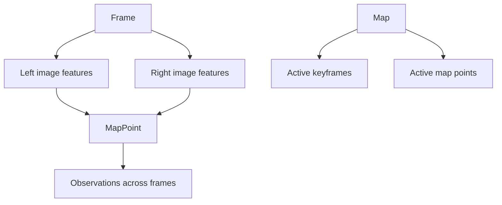

# Chapter 12 - Practice: Stereo Visual Odometry

## Overview

Chapter 12 is an engineering chapter. The earlier chapters introduced the parts of visual SLAM separately. This chapter combines them into a simplified stereo visual odometry system, using optical-flow tracking, stereo depth, map management, and backend optimization.

> [!summary]
> Knowing the algorithms is not the same as building a SLAM system. The engineering problem is how to organize data, threads, modules, and failure handling so the pieces cooperate.

## Why Stereo VO

The chapter chooses stereo visual odometry because stereo cameras provide metric depth from a single stereo pair. This avoids the difficult monocular initialization problem and gives more stable map points.

Stereo VO reuses:

- Stereo geometry from [[Chapter 4 - Cameras and Images#Stereo Cameras]].
- Feature and pose estimation ideas from [[Chapter 6 - Visual Odometry Part I]].
- Optical flow from [[Chapter 7 - Visual Odometry Part II]].
- Backend BA from [[Chapter 8 - Filters and Optimization Approaches Part I]].
- Sliding window control from [[Chapter 9 - Filters and Optimization Approaches Part II]].

## Project Framework

The chapter organizes the project into typical C++ library folders:

- `bin` for binaries.
- `include/myslam` for headers.
- `src` for source files.
- `test` for test programs.
- `config` for configuration files.
- `cmake_modules` for external CMake scripts.

This is not just cosmetic. A SLAM project has enough moving parts that structure becomes part of correctness.

## Core Data Structures

| ![[attachments/slambook-ch6-13/chapter-12-data-structure.png]] |
| :----------------------------------------------------------: |
| Basic relationship among frames, features, and landmarks |

The central data objects are:

**Frame:** One stereo image pair, pose, timestamp, and associated features.

**Feature:** A 2D keypoint in an image, optionally linked to a 3D map point.

**MapPoint:** A 3D landmark with observations from one or more frames.

**Map:** Container for active keyframes and map points.

**Camera:** Intrinsics, extrinsics, and projection functions.

The relationship is:

## Frontend

| ![[attachments/slambook-ch6-13/chapter-12-pipeline.png]] |
| :-----------------------------------------------------: |
| Stereo VO frontend, map, and backend processing pipeline |

The frontend receives new stereo frames and estimates the current pose. Its responsibilities include:

1. Track features from the previous frame, often with optical flow.
2. Estimate pose using tracked map points.
3. Decide whether the current frame should become a keyframe.
4. Detect new features when tracking quality drops.
5. Triangulate new map points from stereo correspondences.
6. Send keyframes and landmarks to the map/backend.

The frontend is responsible for real-time behavior, so it must be fast and robust.

> [!tip]
> In an engineered VO system, "how many features are still tracked?" is not just a statistic. It is often the signal that decides whether to insert a keyframe, add features, or declare tracking lost.

## Backend

The backend runs a slower optimization process over active keyframes and map points. It performs local BA and keeps the problem size bounded.

The local BA objective is the same reprojection minimization from [[Chapter 8 - Filters and Optimization Approaches Part I#Bundle Adjustment]]:

$$
\min
\frac{1}{2}
\sum_{i,j}
\left\|
z_{ij}-h(T_i,p_j)
\right\|^2
$$

The backend then updates optimized poses and map points.

Because frontend and backend may run in different threads, shared data such as frame poses and map points need careful synchronization.

## Keyframes and Map Management

Keyframes prevent the backend from optimizing every frame. A new keyframe is inserted when tracking has changed enough or when the map needs new structure.

The map must remove old or weak elements:

- Old keyframes outside the active window.
- Landmarks with too few observations.
- Outlier map points.
- Features that fail tracking repeatedly.

This is the practical version of the sliding window discussion in [[Chapter 9 - Filters and Optimization Approaches Part II#Sliding Window Optimization]].

## Stereo Triangulation

Given corresponding left and right pixels, stereo depth comes from disparity:

$$
z = \frac{fb}{d}
$$

where $f$ is focal length, $b$ is stereo baseline, and $d$ is disparity.

The map point can then be inserted into the local map and used for future pose estimation.

## Engineering Lessons

The chapter emphasizes that a working SLAM system needs more than formulas:

- Clear data ownership.
- Sensible thresholds.
- Keyframe selection.
- Outlier handling.
- Local map maintenance.
- Visualization and debugging tools.
- Configuration files for fast tuning.

| ![[attachments/slambook-ch6-13/chapter-12-vo-snapshot.png]] |
| :--------------------------------------------------------: |
| Snapshot of the stereo visual odometry output |

> [!warning]
> Many SLAM failures are not caused by a wrong equation. They come from stale map points, poor thresholds, bad synchronization, or unhandled tracking loss.

## Key Terms

**Frame:** A single time step of image data, pose, and associated features.

**Feature:** 2D image observation used for tracking and mapping.

**Map point:** 3D landmark estimated from observations.

**Keyframe:** Selected frame kept for mapping and backend optimization.

**Frontend:** Real-time module that tracks images and estimates current pose.

**Backend:** Optimization module that refines keyframes and map points.

**Local map:** Active subset of keyframes and map points used for real-time optimization.

## Connections

The stereo depth model comes from [[Chapter 4 - Cameras and Images#Stereo Cameras]].

Optical flow tracking comes from [[Chapter 7 - Visual Odometry Part II#Optical Flow]].

Pose and landmark optimization comes from [[Chapter 8 - Filters and Optimization Approaches Part I#Bundle Adjustment]].

The sliding-window design comes from [[Chapter 9 - Filters and Optimization Approaches Part II]].

This chapter prepares the open-source system discussion in [[Chapter 13 - Discussions and Outlook]].

> [!summary]
> Chapter 12 is where the book shifts from "I understand the blocks" to "I can assemble a system." The central lesson is that SLAM performance depends on the interfaces between algorithms as much as the algorithms themselves.
