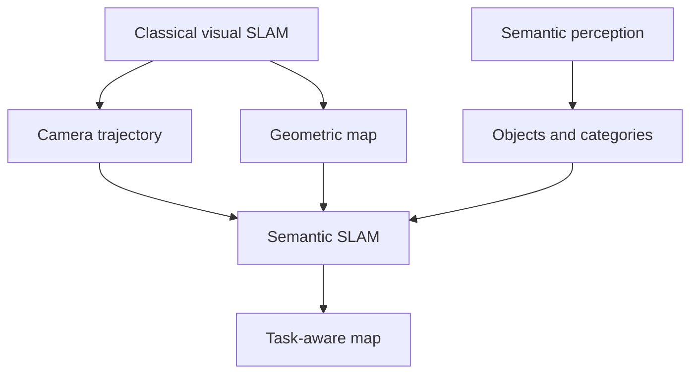

# Chapter 13 - Discussions and Outlook

## Overview

Chapter 13 surveys influential open-source SLAM systems and looks toward future directions. By this point, the book has covered the major parts of the classical visual SLAM pipeline: frontend visual odometry, backend optimization, loop closure, and mapping. This chapter shows how those ideas appear in real systems.

> [!summary]
> Open-source SLAM systems are not just implementations. They are design arguments about which assumptions, sensors, maps, and compute budgets matter.

## Why Study Open-Source Systems

Research papers often describe the core idea, but many practical details live in the code. Open-source systems give learners a way to inspect:

- Module boundaries.
- Threading models.
- Keyframe policies.
- Outlier handling.
- Parameter choices.
- Dataset interfaces.
- Failure recovery.

This connects strongly to the engineering perspective in [[Chapter 12 - Practice Stereo Visual Odometry]].

## MonoSLAM

MonoSLAM was an early real-time monocular visual SLAM system. It used EKF as the backend and tracked sparse features.

Its historical importance is large because it showed online monocular SLAM was possible. From a modern view, it has limitations:

- Small environments.
- Sparse landmarks.
- EKF state and covariance scale poorly.
- Tracking can be fragile.

MonoSLAM illustrates the filtering approach discussed in [[Chapter 8 - Filters and Optimization Approaches Part I#Extended Kalman Filter]].

## PTAM

PTAM, or Parallel Tracking and Mapping, was a major step because it separated tracking from mapping.

Its contributions include:

- Parallel frontend tracking and backend mapping.
- Keyframes.
- Nonlinear optimization instead of EKF.
- Real-time augmented-reality demonstrations.

PTAM strongly influenced the frontend/backend architecture introduced in [[Chapter 1 - Introduction to SLAM#Classical Visual SLAM Framework]].

## ORB-SLAM Series

ORB-SLAM is presented as one of the most complete feature-based systems.

| ![[attachments/slambook-ch6-13/chapter-13-orb-slam.png]] |
| :------------------------------------------------------: |
| ORB-SLAM combines tracking, local mapping, and loop closure in a practical open-source system |

Its strengths include:

- Support for monocular, stereo, and RGB-D sensors.
- ORB features throughout tracking, mapping, and loop closure.
- Strong loop closure and relocalization.
- Three-thread structure: tracking, local mapping, and loop closing/global optimization.
- Careful engineering around feature distribution, matching, and keyframe selection.

Its weaknesses include:

- Feature extraction is computationally expensive.
- Sparse maps are not enough for navigation or dense interaction.
- The system can be heavy for embedded platforms.

ORB-SLAM ties together many previous chapters:

- ORB features from [[Chapter 6 - Visual Odometry Part I#ORB Features]].
- Local BA from [[Chapter 8 - Filters and Optimization Approaches Part I]].
- Pose graph and loop closure from [[Chapter 9 - Filters and Optimization Approaches Part II]] and [[Chapter 10 - Loop Closure]].

## LSD-SLAM

LSD-SLAM is a large-scale direct monocular SLAM system. It uses semi-dense direct tracking and builds semi-dense maps.

| ![[attachments/slambook-ch6-13/chapter-13-lsd-slam.png]] |
| :-----------------------------------------------------: |
| LSD-SLAM produces semi-dense maps from direct monocular tracking |

Its importance is that it made direct methods highly visible in visual SLAM. It relates directly to [[Chapter 7 - Visual Odometry Part II]] and [[Chapter 11 - Dense Reconstruction]].

Strengths:

- Uses more image information than sparse feature methods.
- Produces semi-dense reconstructions.
- Runs in real time on CPU for its target setting.

Weaknesses:

- Sensitive to illumination and camera exposure.
- Requires good photometric assumptions.
- Loop detection may still depend on feature-based methods.

## SVO

SVO means Semi-direct Visual Odometry. It combines feature points and direct tracking.

| ![[attachments/slambook-ch6-13/chapter-13-svo.png]] |
| :------------------------------------------------: |
| SVO tracks selected features with semi-direct patch alignment |

It tracks small patches around selected keypoints using direct alignment. Its major strength is speed, making it attractive for UAVs and other limited-compute platforms.

SVO also uses depth filters, linking it to [[Chapter 11 - Dense Reconstruction#Gaussian Depth Filter]].

Limitations include:

- It is mainly visual odometry without full loop closure.
- Some assumptions are tuned for forward-facing camera motion.
- Drift remains without global correction.

## RTAB-MAP and RGB-D Systems

RTAB-MAP is discussed as a practical system with strong RGB-D and stereo mapping capability. RGB-D systems are closely tied to dense reconstruction and map reuse.

Compared with sparse monocular systems, RGB-D systems can more directly build useful point clouds, occupancy maps, or surface reconstructions, as discussed in [[Chapter 11 - Dense Reconstruction#RGB-D Mapping]].

## Future Direction: Visual-Inertial SLAM

The chapter points to IMU integration as a major direction. Cameras provide rich scene geometry but can fail under motion blur, low texture, or rapid movement. IMUs provide high-rate motion measurements but drift over time.

| ![[attachments/slambook-ch6-13/chapter-13-visual-inertial.png]] |
| :------------------------------------------------------------: |
| More visual SLAM systems combine cameras with IMU sensors |

Together:

- IMU helps prediction and short-term motion.
- Vision corrects long-term drift.
- Scale and gravity can become observable in monocular settings.

Visual-inertial SLAM combines geometry, filtering, optimization, and careful sensor calibration.

## Future Direction: Semantic SLAM

Classical maps represent points, surfaces, or occupancy. Semantic SLAM adds object and category meaning.

| ![[attachments/slambook-ch6-13/chapter-13-semantic-slam.png]] |
| :----------------------------------------------------------: |
| Semantic SLAM augments geometry with object and category labels |

Instead of only asking:

$$
\text{Where is this point?}
$$

semantic SLAM also asks:

$$
\text{What object or region is this?}
$$

This matters for human-robot interaction. A robot that hears "bring the newspaper on the table" needs more than a point cloud. It needs objects, support relationships, and task-level meaning.

## Key Terms

**MonoSLAM:** Early EKF-based real-time monocular SLAM system.

**PTAM:** System that popularized parallel tracking and mapping with keyframes.

**ORB-SLAM:** Feature-based SLAM system using ORB features, local BA, and loop closure.

**LSD-SLAM:** Direct monocular SLAM system using semi-dense tracking and mapping.

**SVO:** Semi-direct visual odometry system known for high speed.

**RTAB-MAP:** Practical mapping and loop-closure system often used with RGB-D/stereo data.

**Visual-inertial SLAM:** SLAM combining camera and IMU measurements.

**Semantic SLAM:** SLAM that adds object/category meaning to geometric maps.

## Connections

MonoSLAM connects to filtering in [[Chapter 8 - Filters and Optimization Approaches Part I]].

PTAM connects to the frontend/backend split from [[Chapter 1 - Introduction to SLAM]].

ORB-SLAM combines the feature method in [[Chapter 6 - Visual Odometry Part I]], local BA from [[Chapter 8 - Filters and Optimization Approaches Part I]], and loop closure from [[Chapter 10 - Loop Closure]].

LSD-SLAM and SVO connect to direct methods in [[Chapter 7 - Visual Odometry Part II]] and depth filtering in [[Chapter 11 - Dense Reconstruction]].

Semantic mapping extends the map-use discussion from [[Chapter 11 - Dense Reconstruction#Why Sparse Feature Maps Are Not Enough]].

> [!summary]
> Chapter 13 closes the book by showing that SLAM is a family of system designs. Each system chooses a point in the trade-off space between accuracy, robustness, density, speed, sensors, and map meaning.
