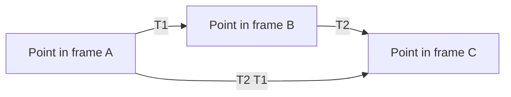

	
# Chapter 2 - 3D Rigid Body Motion

## Overview

This chapter explains how to represent the motion of a rigid body in 3D. In visual SLAM, the camera is treated as a rigid body, so its state is not only a position but also an orientation. The chapter builds the mathematical tools needed to describe camera poses: rotation matrices, transformation matrices, homogeneous coordinates, rotation vectors, Euler angles, quaternions, and common transformation groups.

> [!summary]
> A 3D pose is a rotation plus a translation. Most of the chapter is about representing rotation well, because rotation is constrained and easy to mishandle.

## Points, Vectors, and Coordinate Systems

A vector exists geometrically before it has coordinates. Coordinates appear only after choosing a basis. For a basis $(e_1, e_2, e_3)$, a vector $a$ can be written as:

$$
a =
\begin{bmatrix}
e_1 & e_2 & e_3
\end{bmatrix}
\begin{bmatrix}
a_1 \\
a_2 \\
a_3
\end{bmatrix}
= a_1e_1 + a_2e_2 + a_3e_3
$$

This distinction matters because the same physical point or vector has different coordinates in different frames.

The inner product measures projection and angle:

$$
a \cdot b = a^T b = \lVert a\rVert \lVert b\rVert \cos \langle a,b\rangle
$$

The outer product can be written using a skew-symmetric matrix:

$$
a \times b = a^\wedge b
$$

where:

$$
a^\wedge =
\begin{bmatrix}
0 & -a_3 & a_2 \\
a_3 & 0 & -a_1 \\
-a_2 & a_1 & 0
\end{bmatrix}
$$

The inverse mapping from a skew-symmetric matrix back to a vector is often written as $(\cdot)^\vee$.

> [!tip]
> In this book, the hat operator $^\wedge$ usually means "turn this vector into the matrix form that performs a cross product."

## Coordinate Transformations

| ![[attachments/slambook-first5/chapter-2-coordinate-transform.png]] |
| :-----------------------------------------------------------------: |
| Coordinate transform between world and camera frames |

SLAM constantly converts points between coordinate systems. For example, a point may be represented in the camera coordinate frame or in the world coordinate frame. The physical point is the same; the coordinates differ because the basis and origin differ.

A rigid body motion is a **Euclidean transform**: it preserves distances, angles, and shape. It consists of a rotation $R$ and translation $t$:

$$
a' = Ra + t
$$

If frame 2 coordinates are transformed into frame 1 coordinates, the book writes:

$$
a_1 = R_{12}a_2 + t_{12}
$$

> [!warning]
> Be careful with subscripts. $R_{12}$ means rotation from frame 2 into frame 1 in this book's convention. Also, $t_{21}$ is not simply $-t_{12}$ because the coordinates are expressed in different frames.

## Rotation Matrices and SO(3)

A rotation matrix is orthogonal and has determinant $1$:

$$
R^TR = I, \qquad \det(R)=1
$$

The set of all $n$-dimensional rotation matrices is:

$$
SO(n)=\{R \in \mathbb{R}^{n \times n} \mid RR^T=I,\det(R)=1\}
$$

For 3D SLAM, the important case is:

$$
R \in SO(3)
$$

The inverse of a rotation matrix is its transpose:

$$
R^{-1} = R^T
$$

## Transformation Matrices and SE(3)

The equation $a' = Ra + t$ is not linear in ordinary 3D coordinates because of the added translation. Homogeneous coordinates solve this by appending $1$:

$$
\begin{bmatrix}
a' \\
1
\end{bmatrix}
=
\begin{bmatrix}
R & t \\
0^T & 1
\end{bmatrix}
\begin{bmatrix}
a \\
1
\end{bmatrix}
$$

The transformation matrix is:

$$
T =
\begin{bmatrix}
R & t \\
0^T & 1
\end{bmatrix}
$$

The set of all 3D Euclidean transformations is:

$$
SE(3)=
\left\{
T=
\begin{bmatrix}
R & t \\
0^T & 1
\end{bmatrix}
\in \mathbb{R}^{4 \times 4}
\mid R \in SO(3), t \in \mathbb{R}^3
\right\}
$$

Its inverse is:

$$
T^{-1} =
\begin{bmatrix}
R^T & -R^Tt \\
0^T & 1
\end{bmatrix}
$$

## Step-by-Step: Composing Motions

Suppose two transformations happen in sequence:

$$
b = T_1a
$$

$$
c = T_2b
$$

Then:

$$
c = T_2T_1a
$$

The transformation closest to the point acts first. This is why transformation order matters.

## Rotation Vectors

A rotation can be represented by an axis $n$ and an angle $\theta$. If $n$ is unit length, the rotation vector is:

$$
\phi = \theta n
$$

The conversion from rotation vector to rotation matrix is Rodrigues' formula:

$$
R = \cos\theta I + (1-\cos\theta)nn^T + \sin\theta n^\wedge
$$

The angle can be recovered from a rotation matrix using:

$$
\theta = \arccos\left(\frac{\operatorname{tr}(R)-1}{2}\right)
$$

The rotation axis $n$ is the eigenvector of $R$ with eigenvalue $1$:

$$
Rn = n
$$

> [!info]
> Rotation vectors are compact: 3 numbers for 3 rotational degrees of freedom. But they are not globally singularity-free.

## Euler Angles

Euler angles decompose a rotation into three rotations about chosen axes. The book emphasizes the common yaw-pitch-roll convention, equivalent to a $ZYX$ order:

1. **Yaw:** rotation about the $Z$ axis.
2. **Pitch:** rotation about the rotated $Y$ axis.
3. **Roll:** rotation about the rotated $X$ axis.

Euler angles are intuitive for humans but troublesome for optimization.

| ![[attachments/slambook-first5/chapter-2-euler-gimbal-lock.png]] |
| :-------------------------------------------------------------: |
| Euler angle decomposition and the gimbal lock singularity |

> [!warning]
> Euler angles suffer from gimbal lock. In yaw-pitch-roll, when pitch reaches $\pm 90^\circ$, two rotation axes align and one degree of freedom is lost.

Euler angles are useful for reading and debugging orientation, but they are usually avoided as optimization variables in SLAM.

## Quaternions

Quaternions represent 3D rotations with four numbers:

$$
q = q_0 + q_1i + q_2j + q_3k
$$

or:

$$
q = [s, v]^T
$$

where $s$ is the real part and $v \in \mathbb{R}^3$ is the imaginary part.

The imaginary units satisfy:

$$
i^2=j^2=k^2=-1
$$

$$
ij=k,\quad jk=i,\quad ki=j
$$

and reversing the multiplication changes the sign:

$$
ji=-k,\quad kj=-i,\quad ik=-j
$$

Quaternion multiplication for $q_a=[s_a,v_a]^T$ and $q_b=[s_b,v_b]^T$ is:

$$
q_aq_b =
\begin{bmatrix}
s_as_b - v_a^Tv_b \\
s_av_b + s_bv_a + v_a \times v_b
\end{bmatrix}
$$

The conjugate is:

$$
q^* = [s, -v]^T
$$

The inverse is:

$$
q^{-1} = \frac{q^*}{\lVert q\rVert^2}
$$

For unit quaternions, $q^{-1}=q^*$.

To rotate a 3D point $p$, first treat it as a pure imaginary quaternion $[0,p]^T$, then compute:

$$
p' = qpq^{-1}
$$

The relationship between quaternion and rotation vector is:

$$
\theta = 2\arccos(q_0)
$$

$$
n =
\frac{[q_1,q_2,q_3]^T}{\sin(\theta/2)}
$$

> [!tip]
> Quaternions are compact enough for storage and robust enough to avoid Euler-angle gimbal lock, but their double-cover behavior means $q$ and $-q$ represent the same rotation.

## Other Transformations

The chapter compares several transformation families.

**Euclidean transform:**

$$
T_E =
\begin{bmatrix}
R & t \\
0^T & 1
\end{bmatrix}
$$

It has 6 degrees of freedom and preserves length, angle, and volume.

**Similarity transform:**

$$
T_S =
\begin{bmatrix}
sR & t \\
0^T & 1
\end{bmatrix}
$$

It has 7 degrees of freedom and adds uniform scale. This becomes important for monocular SLAM and connects to [[Chapter 3 - Lie Group and Lie Algebra#Similarity Transform Group]].

**Affine transform:**

$$
T_A =
\begin{bmatrix}
A & t \\
0^T & 1
\end{bmatrix}
$$

where $A$ is invertible but not necessarily orthogonal.

**Perspective transform:**

$$
T_P =
\begin{bmatrix}
A & t \\
a^T & v
\end{bmatrix}
$$

This is the most general form discussed here and is related to camera projection in [[Chapter 4 - Cameras and Images]].

## Eigen Practice

The chapter uses Eigen to represent matrices and geometry objects:

| ![[attachments/slambook-first5/chapter-2-trajectory-visualization.png]] |
| :-------------------------------------------------------------------: |
| Trajectory visualization after applying pose transformations |

| ![[attachments/slambook-first5/chapter-2-camera-pose-visualization.png]] |
| :--------------------------------------------------------------------: |
| Camera pose visualization with rotation matrix, Euler angles, and quaternion |

- `Eigen::Matrix3d` for rotation matrices.
- `Eigen::AngleAxisd` for rotation vectors.
- `Eigen::Vector3d` for Euler angles.
- `Eigen::Quaterniond` for quaternions.
- `Eigen::Isometry3d` for Euclidean transformations.
- `Eigen::Affine3d` for affine transformations.
- `Eigen::Projective3d` for projective transformations.

> [!warning]
> Eigen does not automatically promote matrix numeric types. Mixing `float` and `double`, or multiplying incompatible dimensions, produces long template errors.

## Key Terms

**Rigid body motion:** Motion that preserves distances and angles.

**Rotation matrix:** A matrix in $SO(3)$ representing 3D rotation.

**Transformation matrix:** A $4 \times 4$ matrix in $SE(3)$ combining rotation and translation.

**Homogeneous coordinates:** Coordinates with an extra component, allowing translation to be represented by matrix multiplication.

**Rotation vector:** A compact axis-angle representation $\phi=\theta n$.

**Euler angles:** A three-angle decomposition of rotation, intuitive but singular.

**Quaternion:** A four-parameter representation of rotation, usually constrained to unit length.

**Gimbal lock:** Loss of one rotational degree of freedom in Euler-angle parameterizations.

## Connections

This chapter gives the pose representation needed by [[Chapter 1 - Introduction to SLAM#Mathematical Formulation of SLAM]].

The constrained nature of $SO(3)$ and $SE(3)$ motivates [[Chapter 3 - Lie Group and Lie Algebra]], where pose updates are performed through Lie algebra perturbations.

The camera pose $T$ is used directly in the projection equation of [[Chapter 4 - Cameras and Images]].

Visual odometry estimates these transformations from image data in [[Chapter 6 - Visual Odometry Part I]] and [[Chapter 7 - Visual Odometry Part II]].

Pose graph optimization in [[Chapter 9 - Filters and Optimization Approaches Part II]] also uses relative transformations between camera poses.

The stereo VO implementation in [[Chapter 12 - Practice Stereo Visual Odometry]] stores and updates frame poses using these same rigid-body concepts.

> [!summary]
> The central practical lesson is: use matrices to transform points, quaternions or Lie algebra for stable rotation handling, and be explicit about which coordinate frame every vector lives in.
