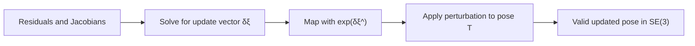

# Chapter 3 - Lie Group and Lie Algebra

## Overview

This chapter explains why SLAM uses Lie groups and Lie algebras to represent and optimize camera poses. Rotation matrices and transformation matrices are useful, but they are constrained: a rotation matrix must remain orthogonal with determinant $1$. Directly optimizing such constrained matrices is awkward.

Lie algebra gives a local vector-space representation of pose. This makes pose updates and derivatives easier, especially in nonlinear least-squares optimization.

> [!summary]
> Lie groups describe valid poses. Lie algebras describe small local updates to those poses.

## Why Lie Theory Appears in SLAM

From [[Chapter 2 - 3D Rigid Body Motion]], rotations belong to:

$$
SO(3)=\{R \in \mathbb{R}^{3 \times 3} \mid RR^T=I,\det(R)=1\}
$$

Rigid transforms belong to:

$$
SE(3)=
\left\{
T=
\begin{bmatrix}
R & t \\
0^T & 1
\end{bmatrix}
\in \mathbb{R}^{4 \times 4}
\mid R \in SO(3), t \in \mathbb{R}^3
\right\}
$$

Both are closed under multiplication, not addition:

$$
R_1R_2 \in SO(3), \qquad T_1T_2 \in SE(3)
$$

but generally:

$$
R_1+R_2 \notin SO(3), \qquad T_1+T_2 \notin SE(3)
$$

This matters because optimization usually wants to apply increments:

$$
x_{k+1}=x_k+\Delta x
$$

For poses, direct addition is not naturally valid. Lie algebra supplies a way to express $\Delta x$ as a vector, then map it back to a valid pose.

## Groups and Lie Groups

A group is a set with an operation satisfying:

- **Closure:** combining two elements stays in the set.
- **Associativity:** grouping does not affect the result.
- **Identity:** there is an element that does nothing.
- **Inverse:** every element has an inverse.

Matrix multiplication makes both $SO(3)$ and $SE(3)$ groups. Because their elements vary smoothly, they are Lie groups.

> [!info]
> A Lie group is both an algebraic object and a smooth geometric space. This is why it can represent continuous robot motion.

## Lie Algebra so(3)

The Lie algebra corresponding to $SO(3)$ is $so(3)$. It can be represented by a vector $\phi \in \mathbb{R}^3$ or its skew-symmetric matrix:

$$
\phi^\wedge =
\begin{bmatrix}
0 & -\phi_3 & \phi_2 \\
\phi_3 & 0 & -\phi_1 \\
-\phi_2 & \phi_1 & 0
\end{bmatrix}
$$

The set is:

$$
so(3)=\{\phi \in \mathbb{R}^3 \text{ or } \Phi=\phi^\wedge \in \mathbb{R}^{3 \times 3}\}
$$

The Lie bracket can be written as:

$$
[\phi_1,\phi_2]=(\Phi_1\Phi_2-\Phi_2\Phi_1)^\vee
$$

Intuitively, $so(3)$ is the tangent space near the identity rotation. It describes small rotational velocity-like changes.

## Lie Algebra se(3)

The Lie algebra corresponding to $SE(3)$ is $se(3)$. Its elements are 6D vectors:

$$
\xi =
\begin{bmatrix}
\rho \\
\phi
\end{bmatrix}
\in \mathbb{R}^6
$$

where $\rho \in \mathbb{R}^3$ is the translational part of the algebra vector and $\phi \in so(3)$ is the rotational part.

The matrix form is:

$$
\xi^\wedge =
\begin{bmatrix}
\phi^\wedge & \rho \\
0^T & 0
\end{bmatrix}
\in \mathbb{R}^{4 \times 4}
$$

> [!warning]
> In $se(3)$, $\rho$ is not always identical to the translation vector $t$ in $SE(3)$. The exponential map relates them through a Jacobian.

## Exponential and Logarithmic Maps

The exponential map takes Lie algebra elements into Lie group elements. The logarithmic map goes the other way.

| ![[attachments/slambook-first5/chapter-3-lie-correspondence.png]] |
| :---------------------------------------------------------------: |
| Correspondence between Lie groups and Lie algebras |

### SO(3) Exponential Map

For $\phi=\theta a$, where $a$ is a unit axis and $\theta$ is the rotation angle:

$$
\exp(\phi^\wedge)
=
\exp(\theta a^\wedge)
=
\cos\theta I + (1-\cos\theta)aa^T + \sin\theta a^\wedge
$$

This is Rodrigues' formula from [[Chapter 2 - 3D Rigid Body Motion#Rotation Vectors]].

The logarithmic map can recover the rotation vector from $R$. The rotation angle is:

$$
\theta = \arccos\left(\frac{\operatorname{tr}(R)-1}{2}\right)
$$

and the axis satisfies:

$$
Ra=a
$$

> [!tip]
> You can remember $so(3)$ as the rotation-vector space and $\exp(\cdot)$ as the operation that turns a rotation vector into a rotation matrix.

### SE(3) Exponential Map

For:

$$
\xi =
\begin{bmatrix}
\rho \\
\phi
\end{bmatrix}
$$

the exponential map has the form:

$$
\exp(\xi^\wedge)=
\begin{bmatrix}
R & J\rho \\
0^T & 1
\end{bmatrix}
=T
$$

where:

$$
R=\exp(\phi^\wedge)
$$

and:

$$
J =
\frac{\sin\theta}{\theta}I
+
\left(1-\frac{\sin\theta}{\theta}\right)aa^T
+
\frac{1-\cos\theta}{\theta}a^\wedge
$$

This explains why $\rho$ and $t$ are related but not identical:

$$
t=J\rho
$$

## Step-by-Step: Pose Update with Lie Algebra

1. Start with a current pose estimate $T \in SE(3)$.
2. Compute a small 6D update vector $\delta \xi \in \mathbb{R}^6$ from optimization.
3. Convert the update into a valid transform:

$$
\Delta T = \exp(\delta \xi^\wedge)
$$

4. Apply the update by multiplication:

$$
T_{\text{new}} = \Delta T T
$$

5. The result remains in $SE(3)$.

## BCH Formula and Perturbations

For scalar numbers:

$$
\exp(a)\exp(b)=\exp(a+b)
$$

For matrices, this is generally false. The Baker-Campbell-Hausdorff formula describes the correction terms:

$$
\ln(\exp(A)\exp(B))
=
A+B+\frac{1}{2}[A,B]+\frac{1}{12}[A,[A,B]]
-\frac{1}{12}[B,[A,B]]+\cdots
$$

For small perturbations, this can be approximated linearly. The chapter distinguishes left and right perturbation models. With a left perturbation:

$$
\exp(\Delta \phi^\wedge)\exp(\phi^\wedge)
\approx
\exp\left((\phi + J_l^{-1}(\phi)\Delta\phi)^\wedge\right)
$$

The important practical result is not the full BCH series but the ability to update poses locally while keeping them on the group.

> [!warning]
> Left and right perturbations are different conventions. Mixing them changes Jacobians and can break an implementation.

## Derivatives on SO(3) and SE(3)

For a rotated point $Rp$, direct differentiation with respect to $R$ is awkward because $R$ is constrained. With a left perturbation, the derivative becomes simple:

$$
\frac{\partial (Rp)}{\partial \phi}
=
-(Rp)^\wedge
$$

For $T \in SE(3)$ and homogeneous point $p$, the perturbation derivative is expressed through the $\odot$ operator:

$$
\frac{\partial (Tp)}{\partial \delta \xi}
=
(Tp)^\odot
$$

where:

$$
(Tp)^\odot =
\begin{bmatrix}
I & -(Rp+t)^\wedge \\
0^T & 0^T
\end{bmatrix}
$$

This derivative is central in pose estimation, visual odometry, and bundle adjustment.

## Sophus Practice

Eigen supports matrices, quaternions, and transformations, but not Lie algebra operations directly. The chapter introduces Sophus for:

- Constructing `SO3d` and `SE3d` from matrices or quaternions.
- Computing logarithmic maps with `.log()`.
- Computing exponential maps with `SO3d::exp()` and `SE3d::exp()`.
- Using `hat()` and `vee()` to switch between vector and matrix forms.
- Applying small updates by multiplication.

> [!tip]
> Sophus makes the "pose plus update" operation explicit: update vectors live in the Lie algebra, poses live in the Lie group.

## Trajectory Evaluation

The chapter introduces common trajectory error measures.

| ![[attachments/slambook-first5/chapter-3-trajectory-error.png]] |
| :------------------------------------------------------------: |
| Difference between an estimated trajectory and the ground-truth trajectory |

For estimated trajectory $T_{\text{esti},i}$ and ground truth $T_{\text{gt},i}$, the absolute trajectory error over all poses can be written as:

$$
ATE_{\text{all}}
=
\sqrt{
\frac{1}{N}
\sum_{i=1}^N
\left\|
\log(T_{\text{gt},i}^{-1}T_{\text{esti},i})^\vee
\right\|_2^2
}
$$

If only translation is considered:

$$
ATE_{\text{trans}}
=
\sqrt{
\frac{1}{N}
\sum_{i=1}^N
\left\|
\operatorname{trans}(T_{\text{gt},i}^{-1}T_{\text{esti},i})
\right\|_2^2
}
$$

Relative pose error compares motion over an interval $\Delta t$ instead of absolute pose.

## Similarity Transform Group

Monocular SLAM has scale ambiguity, so the chapter briefly introduces $Sim(3)$:

$$
p' =
\begin{bmatrix}
sR & t \\
0^T & 1
\end{bmatrix}
p
=sRp+t
$$

The group is:

$$
Sim(3)=
\left\{
S=
\begin{bmatrix}
sR & t \\
0^T & 1
\end{bmatrix}
\in \mathbb{R}^{4 \times 4}
\right\}
$$

Its Lie algebra $sim(3)$ has 7 dimensions:

$$
\zeta =
\begin{bmatrix}
\rho \\
\phi \\
\sigma
\end{bmatrix}
$$

where $\sigma$ controls scale.

## Key Terms

**Lie group:** A smooth group, such as $SO(3)$ or $SE(3)$.

**Lie algebra:** The tangent-space vector representation associated with a Lie group.

**Exponential map:** Maps Lie algebra vectors to Lie group elements.

**Logarithmic map:** Maps Lie group elements back to Lie algebra vectors.

**Hat operator:** Converts a vector into its matrix representation.

**Vee operator:** Converts the matrix representation back into a vector.

**BCH formula:** Describes how multiplication in the group corresponds to addition plus correction terms in the algebra.

**Perturbation model:** A method for applying small updates to poses by multiplication.

**Sophus:** A C++ Lie group/Lie algebra library built on Eigen.

## Connections

This chapter depends on the pose representations from [[Chapter 2 - 3D Rigid Body Motion]].

The perturbation derivatives are used by visual odometry and pose estimation in later chapters.

Feature-based PnP and ICP use Lie perturbations for pose refinement in [[Chapter 6 - Visual Odometry Part I]].

The direct method uses Lie algebra increments inside photometric optimization in [[Chapter 7 - Visual Odometry Part II]].

The optimization viewpoint connects directly to [[Chapter 5 - Nonlinear Optimization]], where small increments are solved through least-squares.

The camera projection equation in [[Chapter 4 - Cameras and Images]] uses $T$ to move world points into the camera frame before projection.

Bundle adjustment and pose graph optimization rely on these perturbation models in [[Chapter 8 - Filters and Optimization Approaches Part I]] and [[Chapter 9 - Filters and Optimization Approaches Part II]].

> [!summary]
> Lie algebra is the bridge between geometric validity and numerical optimization: optimize small vectors, then map them back to valid rotations and poses.
