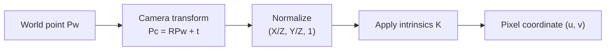

# Chapter 4 - Cameras and Images

## Overview

This chapter makes the SLAM observation equation concrete. In earlier chapters, observations were written abstractly as $z=h(x,y)+v$. Here, $h(\cdot)$ becomes the camera projection model: a 3D point in the world is transformed into the camera frame, projected onto a normalized plane, distorted by the lens, and converted into pixel coordinates using camera intrinsics.

The chapter also introduces stereo and RGB-D cameras, image storage, OpenCV basics, undistortion, and 3D point cloud construction.

> [!summary]
> Camera geometry explains how 3D world points become 2D pixels. Visual SLAM depends on reversing or constraining this projection process.

## Pinhole Camera Model

| ![[attachments/slambook-first5/chapter-4-pinhole-model.png]] |
| :----------------------------------------------------------: |
| Pinhole camera projection model |

The pinhole model describes how a 3D point projects through the optical center onto an image plane.

Let a point in camera coordinates be:

$$
P = [X,Y,Z]^T
$$

With focal length $f$, the projected physical image coordinates are:

$$
X' = f\frac{X}{Z}
$$

$$
Y' = f\frac{Y}{Z}
$$

This division by $Z$ is the key operation: depth controls image scale.

> [!warning]
> Projection loses depth. Many 3D points along the same camera ray can produce the same pixel if $Z$ is unknown.

## Pixel Coordinates and Intrinsics

The physical image plane is measured in metric units, but digital images are measured in pixels. Let:

- $u,v$ be pixel coordinates.
- $f_x,f_y$ be focal lengths in pixel units.
- $c_x,c_y$ be the principal point.

The pixel projection is:

$$
u = f_x\frac{X}{Z}+c_x
$$

$$
v = f_y\frac{Y}{Z}+c_y
$$

In matrix form:

$$
Z
\begin{bmatrix}
u \\
v \\
1
\end{bmatrix}
=
\begin{bmatrix}
f_x & 0 & c_x \\
0 & f_y & c_y \\
0 & 0 & 1
\end{bmatrix}
\begin{bmatrix}
X \\
Y \\
Z
\end{bmatrix}
=KP
$$

The intrinsic matrix is:

$$
K =
\begin{bmatrix}
f_x & 0 & c_x \\
0 & f_y & c_y \\
0 & 0 & 1
\end{bmatrix}
$$

## Extrinsics and the Full Projection Equation

If the point is known in world coordinates $P_w$, it must first be transformed into the camera coordinate system:

$$
P_c = RP_w + t
$$

Using the camera pose transformation $T$, the projection can be written:

$$
ZP_{uv}=Z
\begin{bmatrix}
u \\
v \\
1
\end{bmatrix}
=K(RP_w+t)=KTP_w
$$

The pose $R,t$ is the camera **extrinsic** relationship for the projection.

This connects directly to [[Chapter 2 - 3D Rigid Body Motion]] and [[Chapter 3 - Lie Group and Lie Algebra]], where $R$ and $T$ are represented and optimized.

## Normalized Coordinates

Before applying intrinsics, the camera point is projected onto the normalized plane $Z=1$:

$$
[X,Y,Z]^T \rightarrow [X/Z,Y/Z,1]^T
$$

Then the intrinsic matrix maps normalized coordinates into pixels.



> [!tip]
> Separate the projection mentally into two steps: geometry first, pixels second. Geometry gives normalized coordinates; calibration gives pixel coordinates.

## Lens Distortion

Real lenses deviate from the ideal pinhole model. The chapter discusses two common distortion sources.

**Radial distortion** bends straight lines because lens effects grow with distance from the optical center. It can appear as barrel distortion or pincushion distortion.

|       ![[attachments/slambook-first5/chapter-4-radial-distortion.png]]        |
| :---------------------------------------------------------------------------: |
| Radial distortion: normal image, barrel distortion, and pincushion distortion |

For normalized coordinates $(x,y)$ and $r^2=x^2+y^2$:

$$
x_{\text{distorted}} = x(1+k_1r^2+k_2r^4+k_3r^6)
$$

$$
y_{\text{distorted}} = y(1+k_1r^2+k_2r^4+k_3r^6)
$$

**Tangential distortion** comes from lens and image plane misalignment:

| ![[attachments/slambook-first5/chapter-4-tangential-distortion.png]] |
| :----------------------------------------------------------------: |
| Tangential distortion caused by imperfect lens and sensor alignment |

$$
x_{\text{distorted}}
=x+2p_1xy+p_2(r^2+2x^2)
$$

$$
y_{\text{distorted}}
=y+p_1(r^2+2y^2)+2p_2xy
$$

The combined radial-tangential model is:

$$
x_{\text{distorted}}
=x(1+k_1r^2+k_2r^4+k_3r^6)+2p_1xy+p_2(r^2+2x^2)
$$

$$
y_{\text{distorted}}
=y(1+k_1r^2+k_2r^4+k_3r^6)+p_1(r^2+2y^2)+2p_2xy
$$

> [!info]
> Many SLAM systems undistort images first, then proceed as if the ideal pinhole model applies.

## Step-by-Step: Monocular Projection Pipeline

1. Start with a world point $P_w$.
2. Transform it into camera coordinates:

$$
P_c = RP_w+t
$$

3. Normalize:

$$
P_n = [X/Z,Y/Z,1]^T
$$

4. Apply distortion if using distorted image coordinates.
5. Apply camera intrinsics:

$$
P_{uv}=KP_n
$$

6. Read the pixel coordinate $(u,v)$.

## Stereo Cameras

A monocular camera cannot determine depth from a single image. A stereo camera solves this by using two cameras separated by a known baseline $b$.

|   ![[attachments/slambook-first5/chapter-4-single-pixel-ray-depth.png]]   |
| :-----------------------------------------------------------------------: |
| A single pixel corresponds to an entire camera ray unless depth is known  |
| ![[attachments/slambook-first5/chapter-4-Geometry model of stereo cameras from upside down view.png]] |
|          Geometry model of stereo cameras from upside down view           |
Let:

- $f$ be focal length.
- $u_L$ be the left image horizontal coordinate.
- $u_R$ be the right image horizontal coordinate.
- $d=u_L-u_R$ be disparity.

Depth is:

$$
z = \frac{fb}{d}
$$

> [!tip]
> Stereo depth is inversely proportional to disparity. Close points move a lot between left and right images; far points barely move.

Stereo depth estimation requires pixel matching, which is computationally expensive and unreliable in low-texture regions.

## RGB-D Cameras

RGB-D cameras actively measure depth for each pixel. The chapter describes two common principles:

- **Structured light:** projects a known infrared pattern and estimates depth from its deformation.
- **Time-of-flight:** measures how long emitted light takes to return.

RGB-D cameras output a color image plus a depth image. With intrinsics, each depth pixel can be back-projected into 3D:

| ![[attachments/slambook-first5/chapter-4-rgbd-camera-principles.png]] |
| :-----------------------------------------------------------------: |
| Structured-light and time-of-flight RGB-D camera principles |

$$
Z = d / s
$$

$$
X = \frac{(u-c_x)Z}{f_x}
$$

$$
Y = \frac{(v-c_y)Z}{f_y}
$$

where $s$ is a depth scale factor.

If the camera pose is known, the 3D point can be transformed into the world frame and added to a global point cloud.

## Images as Matrices

A grayscale image can be treated as a function:

$$
I(x,y):\mathbb{R}^2 \rightarrow \mathbb{R}
$$

In a computer, pixel coordinates are discrete. A grayscale image of width $w$ and height $h$ stores intensity values at integer coordinates:

$$
x \in \{0,\dots,w-1\}, \qquad y \in \{0,\dots,h-1\}
$$

In C/C++ arrays, the first index is row and the second is column:

```Cpp
unsigned char pixel = image[y][x];
```

> [!warning]
> The order is easy to mix up: image coordinates are often discussed as $(x,y)$, but memory access is usually `[row][column]`, or `[y][x]`.

Color images use multiple channels. OpenCV's default color channel order is BGR, not RGB.

## OpenCV Practice

The chapter introduces basic OpenCV operations:

- Reading images with `cv::imread`.
- Displaying images with `cv::imshow`.
- Accessing pixel memory through `cv::Mat::ptr`.
- Distinguishing shallow copy from deep copy.
- Using `clone()` when true data duplication is needed.

It also implements image undistortion manually to show the projection model rather than treating `cv::undistort` as magic.

## Stereo and RGB-D Point Clouds

For stereo, the chapter uses OpenCV's SGBM method to compute disparity, then converts disparity into depth:

| ![[attachments/slambook-first5/chapter-4-stereo-point-cloud-example.png]] |
| :---------------------------------------------------------------------: |
| Stereo images, disparity map, and reconstructed point cloud |

$$
Z = \frac{f_xb}{d}
$$

Then:

$$
X = \frac{(u-c_x)Z}{f_x}
$$

$$
Y = \frac{(v-c_y)Z}{f_y}
$$

For RGB-D, the depth image already provides $Z$. Each RGB-D frame can produce a local point cloud, and known camera poses can merge several local clouds into a global one.

| ![[attachments/slambook-first5/chapter-4-rgbd-point-cloud.png]] |
| :------------------------------------------------------------: |
| Global point cloud built from multiple RGB-D image pairs |

## Key Terms

**Pinhole model:** Ideal camera projection through a single optical center.

**Focal length:** Distance parameter controlling projection scale.

**Intrinsics:** Camera-internal parameters $f_x,f_y,c_x,c_y$.

**Extrinsics:** Camera pose or installation transform relative to another coordinate frame.

**Normalized plane:** The $Z=1$ plane used before applying pixel intrinsics.

**Radial distortion:** Lens distortion that changes with distance from the optical center.

**Tangential distortion:** Distortion caused by lens and sensor misalignment.

**Disparity:** Difference between matching pixel coordinates in stereo images.

**Depth image:** Image whose pixel values encode distance.

**Point cloud:** A set of 3D points, often with color.

## Connections

The full projection equation uses transformations from [[Chapter 2 - 3D Rigid Body Motion]].

Pose optimization for projection residuals uses perturbations from [[Chapter 3 - Lie Group and Lie Algebra]].

The observation equation becomes part of the least-squares state estimation problem in [[Chapter 5 - Nonlinear Optimization]].

Epipolar geometry, triangulation, PnP, and ICP in [[Chapter 6 - Visual Odometry Part I]] all depend on this projection model.

The direct method in [[Chapter 7 - Visual Odometry Part II]] uses the same projection function, but compares image brightness instead of feature reprojection.

Stereo and RGB-D depth become dense mapping inputs in [[Chapter 11 - Dense Reconstruction]] and are used in the stereo VO system in [[Chapter 12 - Practice Stereo Visual Odometry]].

> [!summary]
> Chapter 4 turns visual SLAM from abstract state estimation into concrete geometry: transform a world point into the camera, divide by depth, apply calibration, and compare the predicted pixel with the observed pixel.
