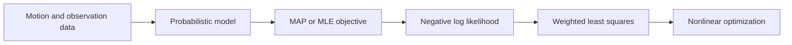
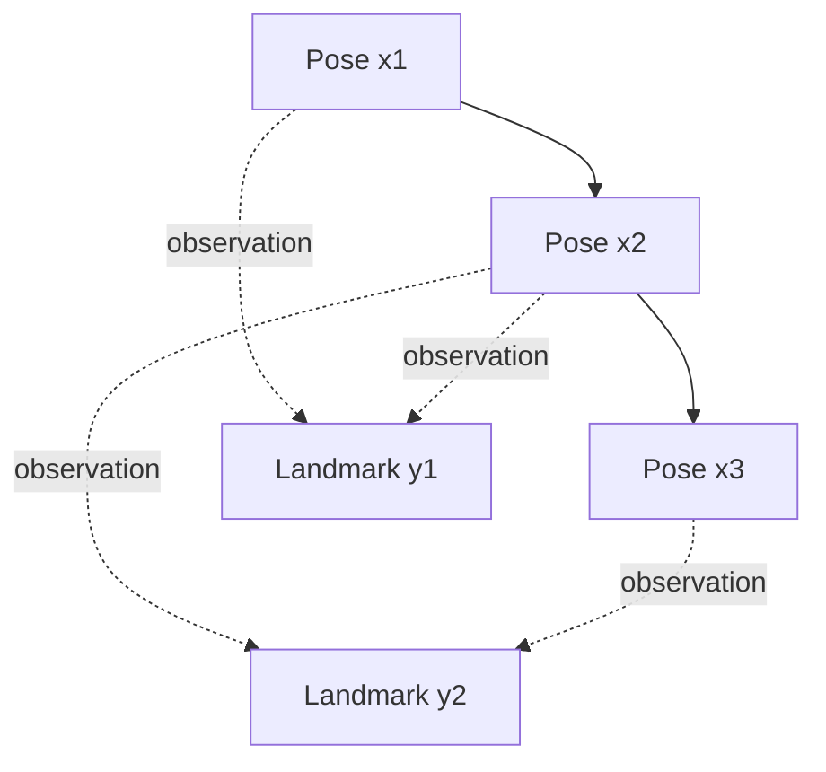

# Chapter 5 - Nonlinear Optimization

## Overview

This chapter explains how noisy SLAM motion and observation equations become a nonlinear least-squares problem. Earlier chapters defined pose, Lie algebra updates, and camera projection. Now the question is: given noisy data, what poses and map points best explain the observations?

The chapter introduces state estimation, maximum likelihood, least squares, Gauss-Newton, Levenberg-Marquardt, and practical optimization libraries such as Ceres and g2o.

> [!summary]
> SLAM backend estimation is usually nonlinear least squares: choose states that minimize weighted prediction errors from motion and observation models.

## From SLAM Equations to State Estimation

The classical SLAM model is:

$$
\begin{cases}
x_k = f(x_{k-1},u_k)+w_k \\
z_{k,j}=h(y_j,x_k)+v_{k,j}
\end{cases}
$$

where:

- $x_k$ is the pose at time $k$.
- $u_k$ is the motion input.
- $y_j$ is landmark $j$.
- $z_{k,j}$ is the observation of landmark $j$ at pose $x_k$.
- $w_k$ is motion noise.
- $v_{k,j}$ is observation noise.

For visual SLAM, $x_k$ can be represented as $T_k \in SE(3)$ from [[Chapter 3 - Lie Group and Lie Algebra]], and the observation model $h(\cdot)$ is the camera projection model from [[Chapter 4 - Cameras and Images]].

The camera observation equation can be written:

$$
sz_{k,j}=K(R_ky_j+t_k)
$$

where $K$ is the camera intrinsic matrix and $s$ is the depth scale.

## Noise Assumptions

The chapter assumes Gaussian noise:

$$
w_k \sim \mathcal{N}(0,R_k)
$$

$$
v_k \sim \mathcal{N}(0,Q_{k,j})
$$

Under Gaussian noise, maximizing likelihood becomes equivalent to minimizing a weighted squared error.

> [!tip]
> The inverse covariance is called the information matrix. High-confidence measurements receive larger weights.

## Batch and Incremental Estimation

There are two broad ways to estimate the state.

**Incremental methods** update the current state as new data arrives. Filtering methods such as EKF-SLAM are examples.

**Batch methods** optimize a collection of poses and map points together. Batch optimization is easier to introduce mathematically and is central to modern visual SLAM, though real systems often use sliding windows or selected keyframes for efficiency.

Let all poses and landmarks be:

$$
x=\{x_1,\dots,x_N\}
$$

$$
y=\{y_1,\dots,y_M\}
$$

The state estimation target is:

$$
P(x,y \mid z,u)
$$

## Bayes, MAP, and MLE

Using Bayes' rule:

$$
P(x,y \mid z,u)
=
\frac{P(z,u \mid x,y)P(x,y)}{P(z,u)}
$$

Since $P(z,u)$ does not depend on the state, maximizing the posterior gives:

$$
(x,y)^*_{\text{MAP}}
=
\arg\max P(z,u \mid x,y)P(x,y)
$$

This is **maximum a posteriori** estimation.

If no prior is used:

$$
(x,y)^*_{\text{MLE}}
=
\arg\max P(z,u \mid x,y)
$$

This is **maximum likelihood estimation**.

## Least-Squares Form

For an observation:

$$
z_{k,j}=h(x_k,y_j)+v_{k,j}
$$

define residual:

$$
e_{z,k,j}=z_{k,j}-h(x_k,y_j)
$$

For motion:

$$
e_{u,k}=x_k-f(x_{k-1},u_k)
$$

The full objective is:

$$
\min J(x,y)
=
\sum_k e_{u,k}^TR_k^{-1}e_{u,k}
+
\sum_k\sum_j e_{z,k,j}^TQ_{k,j}^{-1}e_{z,k,j}
$$

This is the core backend optimization problem.

> [!info]
> Each residual usually touches only a small number of variables, such as two consecutive poses or one pose and one landmark. This sparse structure is what makes large SLAM optimization practical.

## Simple Batch Example

The chapter gives a 1D system:

$$
x_k=x_{k-1}+u_k+w_k
$$

$$
z_k=x_k+n_k
$$

with Gaussian noise. The residuals are:

$$
e_{u,k}=x_k-x_{k-1}-u_k
$$

$$
e_{z,k}=z_k-x_k
$$

The least-squares objective is:

$$
\min
\sum_{k=1}^3 e_{u,k}^TQ_k^{-1}e_{u,k}
+
\sum_{k=1}^3 e_{z,k}^TR_k^{-1}e_{z,k}
$$

For a linear system, the solution can be written in closed form:

$$
x^*=(H^T\Sigma^{-1}H)^{-1}H^T\Sigma^{-1}y
$$

But real visual SLAM is nonlinear, so iterative methods are needed.

## Nonlinear Least Squares

The general nonlinear least-squares problem is:

$$
\min_x F(x)=\frac{1}{2}\lVert f(x)\rVert_2^2
$$

The iterative strategy is:

1. Start with an initial value $x_0$.
2. At iteration $k$, find an increment $\Delta x_k$ that reduces the objective.
3. If $\Delta x_k$ is small enough, stop.
4. Otherwise update:

$$
x_{k+1}=x_k+\Delta x_k
$$

For poses, this "addition" is replaced by Lie algebra perturbation as described in [[Chapter 3 - Lie Group and Lie Algebra#Step-by-Step: Pose Update with Lie Algebra]].

## First- and Second-Order Methods

At the current estimate $x$, Taylor expansion gives:

$$
F(x+\Delta x)
\approx
F(x)+J(x)^T\Delta x+\frac{1}{2}\Delta x^TH(x)\Delta x
$$

Keeping only first-order information gives steepest descent:

$$
\Delta x^*=-J(x)
$$

Keeping second-order information gives Newton's method:

$$
H\Delta x=-J
$$

Newton's method can converge quickly but requires computing the Hessian, which is expensive for large problems.

## Gauss-Newton Method

Gauss-Newton approximates the residual function $f(x)$, not the whole objective:

$$
f(x+\Delta x)\approx f(x)+J(x)^T\Delta x
$$

Then it solves:

$$
\Delta x^*
=
\arg\min_{\Delta x}
\frac{1}{2}\lVert f(x)+J(x)^T\Delta x\rVert^2
$$

This leads to the normal equation:

$$
H\Delta x=g
$$

where:

$$
H=J(x)J(x)^T
$$

$$
g=-J(x)f(x)
$$

The algorithm is:

1. Choose $x_0$.
2. Compute residuals and Jacobians.
3. Solve $H\Delta x=g$.
4. Update $x$.
5. Repeat until convergence.

> [!warning]
> Gauss-Newton can fail if $H$ is singular or ill-conditioned, or if the step is too large for the local linear approximation to remain valid.

## Levenberg-Marquardt Method

Levenberg-Marquardt improves robustness by adding a trust region. It asks the step to stay inside a region where the approximation is trusted:

$$
\min_{\Delta x_k}
\frac{1}{2}
\lVert f(x_k)+J(x_k)^T\Delta x_k\rVert^2,
\qquad
\text{s.t. } \lVert D\Delta x_k\rVert^2 \le \mu
$$

The quality of the approximation is measured by:

$$
\rho =
\frac{f(x+\Delta x)-f(x)}
{J(x)^T\Delta x}
$$

If the approximation is good, the trust region can expand. If it is poor, the trust region shrinks.

The resulting damped normal equation is:

$$
(H+\lambda D^TD)\Delta x_k=g
$$

With $D=I$:

$$
(H+\lambda I)\Delta x_k=g
$$

When $\lambda$ is small, the method behaves like Gauss-Newton. When $\lambda$ is large, it behaves more like steepest descent.

> [!tip]
> Use Gauss-Newton when the problem is well-conditioned and the initial value is good. Use Levenberg-Marquardt when robustness matters more.

## Curve Fitting Example

The practice section fits a nonlinear curve:

| ![[attachments/slambook-first5/chapter-5-curve-fitting-result.png]] |
| :---------------------------------------------------------------: |
| Nonlinear curve fitting result with noisy data, ground truth, and estimated curve |

$$
y=\exp(ax^2+bx+c)+w
$$

The goal is to estimate $a,b,c$ from noisy data:

$$
\min_{a,b,c}
\frac{1}{2}
\sum_{i=1}^N
\left(
y_i-\exp(ax_i^2+bx_i+c)
\right)^2
$$

Define the residual:

$$
e_i=y_i-\exp(ax_i^2+bx_i+c)
$$

The Jacobian entries are:

$$
\frac{\partial e_i}{\partial a}
=
-x_i^2\exp(ax_i^2+bx_i+c)
$$

$$
\frac{\partial e_i}{\partial b}
=
-x_i\exp(ax_i^2+bx_i+c)
$$

$$
\frac{\partial e_i}{\partial c}
=
-\exp(ax_i^2+bx_i+c)
$$

The example demonstrates the same problem three ways:

- Handwritten Gauss-Newton.
- Ceres.
- g2o.
## Ceres

Ceres is a general nonlinear least-squares library. The chapter's workflow is:

1. Define parameter blocks.
2. Define residual blocks.
3. Provide Jacobians manually or use automatic differentiation.
4. Add residual blocks to a `ceres::Problem`.
5. Configure solver options.
6. Call `ceres::Solve`.

Ceres is convenient because automatic differentiation reduces hand-derived Jacobian code.

## g2o and Graph Optimization

g2o expresses nonlinear least squares as a graph:

- Vertices are optimization variables.
- Edges are residual/error terms.

|            ![[attachments/slambook-first5/chapter-5-graph-optimization.png]]            |
| :-------------------------------------------------------------------------------------: |
| Graph optimization structure with poses, landmarks, motion edges, and observation edges |

This representation is natural for SLAM because poses and landmarks form a sparse network of constraints.

For the curve-fitting example, there is one vertex $(a,b,c)$ and each data point contributes a unary edge.

|     ![[attachments/slambook-first5/chapter-5-curve-fitting-graph-model.png]]     |
| :------------------------------------------------------------------------------: |
| Graph model of curve fitting: one parameter vertex and many unary residual edges |

For SLAM, a pose-landmark observation edge connects a camera pose vertex and a landmark vertex. A motion edge connects two pose vertices.

## Step-by-Step: Solving a SLAM Backend Problem

1. Choose state variables: poses, landmarks, calibration parameters, or other quantities.
2. Define residuals from motion and observation models.
3. Weight each residual by its information matrix.
4. Linearize residuals around the current estimate.
5. Solve the linear system for increments.
6. Apply increments to variables, using Lie perturbations for poses.
7. Repeat until convergence.
8. Use sparsity to make the computation efficient.

## Key Terms

**State estimation:** Inferring hidden states from noisy measurements.

**MAP:** Maximum a posteriori estimation; maximizes likelihood times prior.

**MLE:** Maximum likelihood estimation; maximizes likelihood without using a prior.

**Residual:** Difference between measurement and model prediction.

**Information matrix:** Inverse covariance matrix; weights confidence in a residual.

**Least squares:** Minimizing the sum of squared residuals.

**Jacobian:** Matrix of first derivatives of residuals with respect to variables.

**Hessian:** Matrix of second derivatives of the objective.

**Normal equation:** Linear system solved for the optimization increment.

**Trust region:** Region where the local approximation is considered reliable.

**Graph optimization:** Representation of variables as vertices and residuals as edges.

## Connections

The state variable $x_k$ uses pose representations from [[Chapter 2 - 3D Rigid Body Motion]].

Pose increments should be applied using Lie algebra from [[Chapter 3 - Lie Group and Lie Algebra]].

The observation residuals come from the camera projection model in [[Chapter 4 - Cameras and Images]].

The overall system architecture is the backend part of [[Chapter 1 - Introduction to SLAM#Classical Visual SLAM Framework]].

Pose-only PnP, ICP, and direct visual odometry reuse this nonlinear least-squares machinery in [[Chapter 6 - Visual Odometry Part I]] and [[Chapter 7 - Visual Odometry Part II]].

The backend version becomes bundle adjustment in [[Chapter 8 - Filters and Optimization Approaches Part I]] and pose graph optimization in [[Chapter 9 - Filters and Optimization Approaches Part II]].

Loop-closure constraints from [[Chapter 10 - Loop Closure]] are useful because they add new residuals that the optimizer can use to correct drift.

> [!summary]
> Chapter 5 is where the previous geometry becomes an estimator: predict measurements, compare them with real data, weight the errors, solve for small updates, and repeat.
