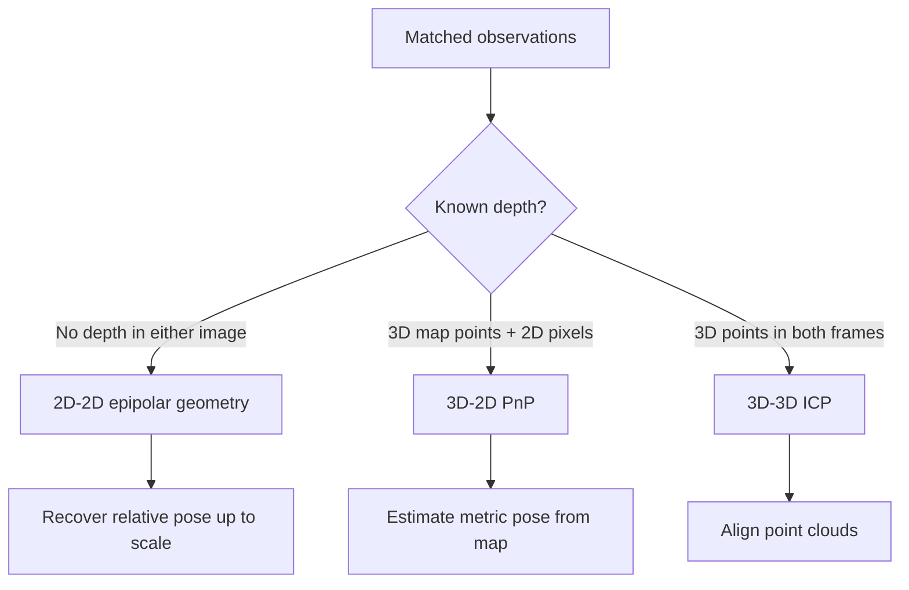

# Chapter 6 - Visual Odometry Part I

## Overview

This chapter begins the practical visual odometry part of the book. The earlier chapters built the mathematical foundation: rigid motion in [[Chapter 2 - 3D Rigid Body Motion]], Lie algebra updates in [[Chapter 3 - Lie Group and Lie Algebra]], camera projection in [[Chapter 4 - Cameras and Images]], and least-squares optimization in [[Chapter 5 - Nonlinear Optimization]]. Chapter 6 combines those tools into the feature-based frontend.

The chapter studies how to extract image features, match them across images, estimate camera motion from different correspondence types, and triangulate 3D structure.

> [!summary]
> Feature-based visual odometry turns image pairs into geometric constraints. Depending on what is known, it solves 2D-2D epipolar geometry, 3D-2D PnP, or 3D-3D ICP.

## Feature-Based Visual Odometry

Visual odometry estimates camera motion from nearby frames. In the feature method, the image is first reduced from millions of pixels to a smaller set of repeatable, distinctive, local measurements.

A good feature should be:

- **Repeatable:** it can be detected again from a nearby viewpoint.
- **Distinctive:** it can be told apart from other features.
- **Efficient:** it is much smaller than the full pixel image.
- **Local:** it describes a small region around a point.

Feature points connect directly to the landmark idea from [[Chapter 1 - Introduction to SLAM#Visual Odometry]]. In a feature-based frontend, selected image points become the observations used to estimate pose and sparse 3D structure.

## ORB Features

ORB means **Oriented FAST and Rotated BRIEF**. It combines a fast corner detector with a binary descriptor suitable for real-time SLAM.

The ORB pipeline is:

1. Detect FAST corner points.
2. Build an image pyramid for scale robustness.
3. Estimate a keypoint orientation using the intensity centroid.
4. Compute a rotated BRIEF binary descriptor.
5. Match descriptors between frames, usually using Hamming distance.

| ![[attachments/slambook-ch6-13/chapter-6-orb-features.png]] |
| :--------------------------------------------------------: |
| ORB feature points detected in an image |

The image moment around a keypoint is:

$$
m_{pq}=\sum_{x,y \in B} x^p y^q I(x,y), \qquad p,q \in \{0,1\}
$$

The intensity centroid is:

$$
C =
\left(
\frac{m_{10}}{m_{00}},
\frac{m_{01}}{m_{00}}
\right)
$$

The keypoint direction is:

$$
\theta = \arctan\left(\frac{m_{01}}{m_{10}}\right)
$$

> [!tip]
> ORB is popular in SLAM because it is not the most accurate feature, but it is fast, compact, and good enough for real-time pose estimation.

## Feature Matching

Feature matching is the data association step. Given descriptors in two images, the frontend decides which image points correspond to the same physical scene point.

For binary descriptors such as BRIEF, the common distance is **Hamming distance**, which counts how many bits differ between two descriptors.

The chapter shows a practical filtering rule: keep matches whose distance is below a threshold related to the best match distance. This helps remove obvious outliers, but it cannot guarantee all matches are correct.

| ![[attachments/slambook-ch6-13/chapter-6-feature-matching.png]] |
| :------------------------------------------------------------: |
| ORB extraction, brute-force matching, and filtered good matches |

> [!warning]
> Feature matching errors are dangerous because later geometry assumes that a matched pair represents the same physical point. Robust estimation and outlier rejection are essential.

## 2D-2D Motion: Epipolar Geometry

When only two monocular images are available, the correspondences are 2D pixels in both images. The camera motion can be estimated using epipolar geometry.

| ![[attachments/slambook-ch6-13/chapter-6-epipolar-constraints.png]] |
| :----------------------------------------------------------------: |
| Epipolar geometry constrains where a matched point can appear in the second image |

Let $P$ be a 3D point observed by two camera frames. In normalized coordinates:

$$
s_1 p_1 = P
$$

$$
s_2 p_2 = RP+t
$$

Eliminating the unknown depth gives the epipolar constraint:

$$
p_2^T t^\wedge R p_1 = 0
$$

The **essential matrix** is:

$$
E = t^\wedge R
$$

So:

$$
p_2^T E p_1 = 0
$$

For pixel coordinates, camera intrinsics are included through the **fundamental matrix**:

$$
F = K^{-T} E K^{-1}
$$

$$
x_2^T F x_1 = 0
$$

> [!info]
> $E$ works with normalized camera coordinates. $F$ works with pixel coordinates.

## Essential Matrix and Homography

The essential matrix can be estimated from point correspondences and then decomposed to recover $R$ and $t$ up to scale. This is why monocular 2D-2D motion has scale ambiguity, first introduced in [[Chapter 1 - Introduction to SLAM#Monocular Camera]].

Decomposing $E$ gives four candidate solutions. Only one places points in front of both cameras, so triangulated depth is used to choose the physically valid solution.

The homography model is useful when the observed points are approximately planar:

$$
x_2 \sim Hx_1
$$

Homography can explain pure planar scenes, while the essential matrix models general 3D structure. Choosing the wrong model can make initialization unstable.

## Triangulation

After camera motion is known, the depth of matched points can be estimated by triangulation.

| ![[attachments/slambook-ch6-13/chapter-6-triangulation.png]] |
| :----------------------------------------------------------: |
| Triangulation estimates point depth from observations at two camera poses |

For two normalized observations:

$$
s_1 x_1 = s_2 R x_2 + t
$$

The unknowns are the depths $s_1$ and $s_2$. With enough camera translation, the two viewing rays intersect or nearly intersect, giving a 3D point estimate.

> [!warning]
> Triangulation needs parallax. If the baseline is too small, a tiny pixel error can create a very large depth error.

## 3D-2D Motion: PnP

PnP, or **Perspective-n-Point**, estimates camera pose from known 3D points and their 2D image projections.

| ![[attachments/slambook-ch6-13/chapter-6-p3p-problem.png]] |
| :-------------------------------------------------------: |
| P3P estimates pose from three 3D-2D correspondences plus a verification point |

This case appears after map points have already been triangulated, or when a stereo/RGB-D system provides depth. The pose can be solved by methods such as DLT, P3P, EPnP, or nonlinear optimization.

The nonlinear pose-only bundle adjustment objective is:

$$
\min_{\xi}
\frac{1}{2}
\sum_i
\left\|
u_i -
\pi\left(K\exp(\xi^\wedge)P_i\right)
\right\|^2
$$

where $\xi \in \mathfrak{se}(3)$ is the pose update from [[Chapter 3 - Lie Group and Lie Algebra]], $P_i$ is a 3D point, and $u_i$ is its observed pixel coordinate.

This directly reuses the least-squares thinking from [[Chapter 5 - Nonlinear Optimization#Nonlinear Least Squares]].

| ![[attachments/slambook-ch6-13/chapter-6-reprojection-error.png]] |
| :--------------------------------------------------------------: |
| Reprojection error compares the observed pixel with the projected 3D point |

| ![[attachments/slambook-ch6-13/chapter-6-pnp-graph.png]] |
| :------------------------------------------------------: |
| PnP as a graph optimization problem with one pose vertex and many projection edges |

## 3D-3D Motion: ICP

ICP, or **Iterative Closest Point**, estimates motion between two sets of corresponding 3D points. In RGB-D or stereo SLAM, each matched feature may have depth in both frames, turning the problem into 3D-3D alignment.

The least-squares objective is:

$$
\min_{R,t}
\frac{1}{2}
\sum_i
\left\|
p_i - (Rq_i+t)
\right\|^2
$$

The chapter describes two solution styles:

- **SVD-based ICP:** subtract centroids, solve rotation by singular value decomposition, then recover translation.
- **Optimization-based ICP:** express pose with Lie algebra and minimize 3D residuals iteratively.

## Choosing the Geometry

## Key Terms

**Feature method:** Visual odometry approach that extracts repeatable image features and estimates motion from their correspondences.

**Keypoint:** The image location, scale, and orientation of a detected feature.

**Descriptor:** A vector or binary code describing the local image patch around a keypoint.

**ORB:** A fast feature combining oriented FAST keypoints and rotated BRIEF descriptors.

**Epipolar constraint:** A geometric relation saying the matching point in the second view lies on an epipolar line.

**Essential matrix:** Matrix encoding relative rotation and translation direction between calibrated cameras.

**Fundamental matrix:** Pixel-coordinate version of the epipolar relation for unnormalized coordinates.

**Triangulation:** Estimating 3D point position from multiple 2D observations and known camera poses.

**PnP:** Estimating camera pose from 3D points and their 2D projections.

**ICP:** Estimating rigid motion between two 3D point sets.

## Connections

Feature extraction and matching provide the frontend measurements introduced in [[Chapter 1 - Introduction to SLAM#Visual Odometry]].

All pose results depend on rigid body transforms from [[Chapter 2 - 3D Rigid Body Motion]] and Lie updates from [[Chapter 3 - Lie Group and Lie Algebra]].

The projection and reprojection-error models come from [[Chapter 4 - Cameras and Images]].

PnP and ICP optimization use the nonlinear least-squares machinery from [[Chapter 5 - Nonlinear Optimization]].

This chapter prepares the contrast with [[Chapter 7 - Visual Odometry Part II]], which replaces descriptor-based matching with optical flow and photometric error.

> [!summary]
> Chapter 6 is the bridge from image features to camera motion: detect points, match them, choose the right geometric problem, estimate pose, and triangulate structure.
