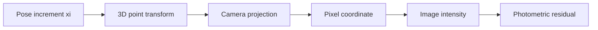

# Chapter 7 - Visual Odometry Part II

## Overview

Chapter 7 introduces optical flow and the direct method. [[Chapter 6 - Visual Odometry Part I]] estimates camera motion from matched features and geometric reprojection errors. This chapter asks whether the frontend can use image brightness directly instead of first computing descriptors and matches.

The key idea is to estimate motion by minimizing **photometric error**, not geometric reprojection error.

> [!summary]
> Feature methods compare selected descriptors. Direct methods compare pixel intensity values after projecting points into another image.

## Motivation for the Direct Method

Feature-based VO has important strengths, but the chapter highlights several weaknesses:

- Keypoint detection and descriptor computation cost time.
- Only a small fraction of image pixels are used.
- Featureless scenes, such as walls or corridors, may not provide enough corners.

The direct method tries to use more of the image by relying on brightness patterns. Depending on how many pixels are used, direct methods can be:

- **Sparse:** use selected pixels.
- **Semi-dense:** use pixels with sufficient gradient.
- **Dense:** use nearly all pixels.

This links to the map discussion in [[Chapter 11 - Dense Reconstruction]], where dense or semi-dense information becomes useful for reconstruction.

## Optical Flow

Optical flow describes how pixels move between images. The chapter focuses on Lucas-Kanade optical flow because it is widely used for tracking points in SLAM frontends.

| ![[attachments/slambook-ch6-13/chapter-7-optical-flow.png]] |
| :--------------------------------------------------------: |
| Optical flow tracks the apparent motion of a pixel through time |

The central assumption is **brightness constancy**:

$$
I(x+dx,y+dy,t+dt)=I(x,y,t)
$$

Using first-order Taylor expansion:

$$
\frac{\partial I}{\partial x}dx
+
\frac{\partial I}{\partial y}dy
+
\frac{\partial I}{\partial t}dt
=0
$$

Dividing by $dt$ gives:

$$
I_x u + I_y v = -I_t
$$

where $u=dx/dt$ and $v=dy/dt$ are the pixel velocities.

One pixel gives one equation with two unknowns, so LK assumes a small image window moves together. Stacking the equations gives:

$$
A
\begin{bmatrix}
u \\
v
\end{bmatrix}
=
-b
$$

The least-squares solution is:

$$
\begin{bmatrix}
u \\
v
\end{bmatrix}^*
=
-(A^TA)^{-1}A^Tb
$$

> [!warning]
> Brightness constancy is an approximation. Exposure changes, specular highlights, shadows, and motion blur can break it.

## Coarse-to-Fine Tracking

Optical flow assumes local motion is small enough for the linear approximation to hold. Large motion can be handled with an image pyramid:

| ![[attachments/slambook-ch6-13/chapter-7-image-pyramid.png]] |
| :---------------------------------------------------------: |
| Coarse-to-fine image pyramid used to handle larger pixel motion |

1. Track motion on a coarse, downsampled image.
2. Upscale the estimate to the next finer level.
3. Refine repeatedly until reaching the original image.

This is the same practical idea behind scale pyramids in ORB from [[Chapter 6 - Visual Odometry Part I#ORB Features]].

## Direct Method

The direct method extends the brightness-constancy idea from 2D pixel motion to 3D camera motion.

| ![[attachments/slambook-ch6-13/chapter-7-direct-method.png]] |
| :----------------------------------------------------------: |
| Direct method: a 3D point is projected into another image and compared by brightness |

Suppose a point $P$ is known in the first camera frame and has image location $p_1$. Under a relative pose $T_{21}$, it projects into the second image:

$$
p_2 = \pi(T_{21}P)
$$

The direct method minimizes the brightness difference:

$$
e = I_1(p_1)-I_2(p_2)
$$

For many points:

$$
\min_{\xi}
\frac{1}{2}
\sum_i
\left\|
I_1(p_i) -
I_2\left(\pi(\exp(\xi^\wedge)P_i)\right)
\right\|^2
$$

The pose update $\xi$ is a Lie algebra increment from [[Chapter 3 - Lie Group and Lie Algebra]].

## Direct Method Jacobian

The residual depends on pose through a chain:

The Jacobian can be understood as:

$$
\frac{\partial e}{\partial \xi}
=
-\frac{\partial I_2}{\partial p_2}
\frac{\partial p_2}{\partial P_2}
\frac{\partial P_2}{\partial \xi}
$$

Each factor has a meaning:

- $\partial I_2 / \partial p_2$ is the image gradient.
- $\partial p_2 / \partial P_2$ is the camera projection Jacobian from [[Chapter 4 - Cameras and Images]].
- $\partial P_2 / \partial \xi$ is the SE(3) perturbation Jacobian from [[Chapter 3 - Lie Group and Lie Algebra]].

## Reprojection Error vs Photometric Error

Feature-based PnP minimizes reprojection error:

$$
e_{\text{geo}} = u - \pi(TP)
$$

The direct method minimizes photometric error:

$$
e_{\text{photo}} = I_1(p)-I_2(\pi(TP))
$$

> [!tip]
> Reprojection error asks: "Does the projected point land on the matched feature?" Photometric error asks: "Does the projected point have the same brightness pattern?"

## Advantages and Disadvantages

Direct methods can be faster because they avoid descriptor computation. They can also use edges and textured regions that may not produce stable corner features.

However, they are more sensitive to:

- Illumination and exposure changes.
- Incorrect depth estimates.
- Large motion without good pyramid tracking.
- Non-convex photometric cost surfaces.

Feature methods are often more robust to lighting and viewpoint changes, while direct methods can use more image information when brightness assumptions hold.

| ![[attachments/slambook-ch6-13/chapter-7-direct-results.png]] |
| :----------------------------------------------------------: |
| Direct method experiment: reference image, disparity/depth, and tracked pixels |

## Key Terms

**Optical flow:** Apparent pixel motion between images.

**Lucas-Kanade optical flow:** Sparse optical flow method using brightness constancy and local-window motion consistency.

**Brightness constancy:** Assumption that the same scene point keeps the same intensity across frames.

**Photometric error:** Difference in pixel intensity after projection into another image.

**Direct method:** VO method that estimates pose by minimizing photometric error.

**Image pyramid:** Multi-resolution image stack used to handle larger motion.

**Semi-dense method:** Direct method that uses pixels with strong enough image gradients.

## Connections

Optical flow can replace descriptor matching in the feature pipeline from [[Chapter 6 - Visual Odometry Part I#Feature Matching]].

The pose update still uses Lie algebra from [[Chapter 3 - Lie Group and Lie Algebra]].

The projection function is the same camera model described in [[Chapter 4 - Cameras and Images]].

The optimization is another nonlinear least-squares problem like [[Chapter 5 - Nonlinear Optimization]].

Dense and semi-dense ideas continue in [[Chapter 11 - Dense Reconstruction]].

> [!summary]
> Chapter 7 shows that visual odometry does not have to start with descriptors. If depth and brightness assumptions are usable, pose can be estimated directly from pixel intensities.
