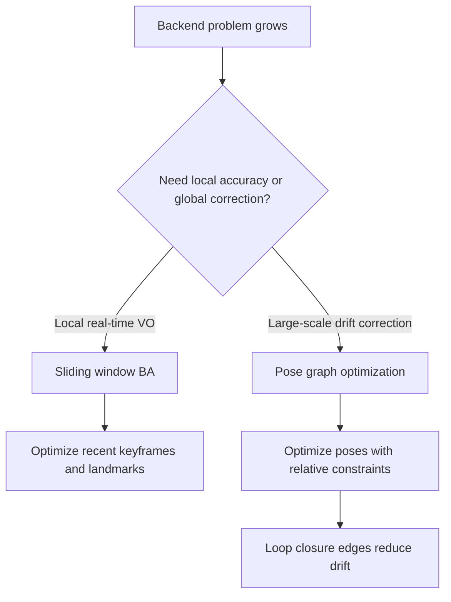

# Chapter 9 - Filters and Optimization Approaches Part II

## Overview

Chapter 9 continues backend optimization from [[Chapter 8 - Filters and Optimization Approaches Part I]]. Bundle adjustment can optimize poses and landmarks accurately, but real-time SLAM cannot let the problem grow forever. This chapter introduces two scale-control strategies: sliding window optimization and pose graph optimization.

> [!summary]
> Sliding windows control local BA size. Pose graphs remove landmarks from the global problem and optimize only pose constraints.

## Why Backend Scale Must Be Controlled

Full bundle adjustment over every keyframe and landmark can become too expensive for online SLAM. The system must keep computation bounded while still using enough information to remain accurate.

Common strategies include:

- Use **keyframes** instead of every frame.
- Optimize only recent frames in a **sliding window**.
- Select local keyframes through a **covisibility graph**.
- Use **pose graph optimization** for large-scale global correction.

| ![[attachments/slambook-ch6-13/chapter-9-covisibility-graph.png]] |
| :--------------------------------------------------------------: |
| Sliding window and covisibility graph as two ways to select a bounded local problem |

These are engineering compromises, but they also have mathematical consequences.

## Sliding Window Optimization

A sliding window keeps a limited number of recent or locally relevant keyframes:

$$
x_1,x_2,\dots,x_N
$$

and their associated landmarks:

$$
y_1,y_2,\dots,y_M
$$

Within the window, local BA can optimize poses and landmarks. After landmark marginalization, the pose distribution can be viewed as:

$$
[x_1,\dots,x_N \mid y_1,\dots,y_M]
\sim
\mathcal{N}
([\mu_1,\dots,\mu_N]^T,\Sigma)
$$

The window must handle two operations:

1. Add a new keyframe and its observations.
2. Remove or marginalize an old keyframe and possibly some landmarks.

## Marginalization and Fill-In

Marginalization means removing a variable while preserving its information as a prior on the remaining variables.

For example:

$$
p(x_1,x_2,x_3,x_4,y_1,\dots,y_6)
=
p(x_2,x_3,x_4,y_1,\dots,y_6 \mid x_1)p(x_1)
$$

After discarding $p(x_1)$, information from $x_1$ remains as a conditional prior.

> [!warning]
> Marginalizing an old keyframe can create dense connections between landmarks. This "fill-in" breaks the sparsity that made BA efficient.

| ![[attachments/slambook-ch6-13/chapter-9-marginalization-fill-in.png]] |
| :------------------------------------------------------------------: |
| Marginalizing an old keyframe can create fill-in in the Hessian matrix |

The chapter separates landmarks observed by the removed keyframe into cases:

- If a landmark only appears in the old keyframe, discard it.
- If it appears in the window but will not be used later, marginalize it too.
- If it may be observed again, practical systems may drop the old observation to preserve sparsity.

## Sliding Window Intuition

Sliding window methods are especially suited to visual odometry. They preserve good local accuracy while preventing the backend from growing without bound.

However, if old information is discarded too aggressively, the system may lose global consistency. This is why loop closure and pose graph optimization are needed later.

## Pose Graph Optimization

Pose graph optimization removes landmarks from the optimization variables and keeps only camera poses.

| ![[attachments/slambook-ch6-13/chapter-9-pose-graph.png]] |
| :-------------------------------------------------------: |
| Pose graph optimization keeps pose nodes and turns landmark information into pose-pose constraints |

In a pose graph:

- Vertices are poses $T_1,\dots,T_n$.
- Edges are relative pose measurements $\Delta T_{ij}$.
- Edges may come from VO, loop closure, GPS, UWB, IMU preintegration, or other pose sensors.

The relative pose between two estimated poses is:

$$
T_{ij}=T_i^{-1}T_j
$$

The edge residual is:

$$
e_{ij}
=
\ln\left(
\Delta T_{ij}^{-1}T_i^{-1}T_j
\right)^\vee
$$

The full objective is:

$$
\min
\frac{1}{2}
\sum_{(i,j)\in E}
e_{ij}^T\Sigma_{ij}^{-1}e_{ij}
$$

This is a graph-optimization version of the least-squares objective from [[Chapter 5 - Nonlinear Optimization#Graph Optimization]].

## Pose Graph Jacobians

Because poses live on $SE(3)$, Jacobians are derived using Lie algebra perturbations. The chapter uses the adjoint relationship:

$$
\exp((Ad(T)\xi)^\wedge)=T\exp(\xi^\wedge)T^{-1}
$$

This lets perturbations be moved across transformations during derivation.

For small errors, systems often approximate the inverse right Jacobian as identity:

$$
J_r^{-1}(e_{ij}) \approx I
$$

This simplification is common in implementation, though it introduces approximation error when residuals are large.

## Sliding Window vs Pose Graph

## Key Terms

**Sliding window:** Backend method that optimizes only a bounded set of recent or local keyframes.

**Marginalization:** Removing variables while preserving their information as priors on remaining variables.

**Fill-in:** Creation of new dense matrix blocks during marginalization.

**Covisibility graph:** Graph linking keyframes that observe common map points.

**Pose graph:** Graph whose vertices are poses and whose edges are relative pose constraints.

**Loop closure edge:** Long-range pose constraint created when a revisited place is recognized.

**Adjoint:** Operator that transforms Lie algebra perturbations between coordinate frames.

## Connections

Sliding window BA builds on bundle adjustment and Schur elimination from [[Chapter 8 - Filters and Optimization Approaches Part I]].

Pose graph optimization uses $SE(3)$ and Lie algebra from [[Chapter 3 - Lie Group and Lie Algebra]].

The global loop constraints needed by pose graphs are introduced in [[Chapter 10 - Loop Closure]].

The engineering version of a frontend/backend sliding-window system appears in [[Chapter 12 - Practice Stereo Visual Odometry]].

> [!summary]
> Chapter 9 explains how SLAM stays computationally alive: optimize enough to remain accurate, but simplify enough to run in real time.
