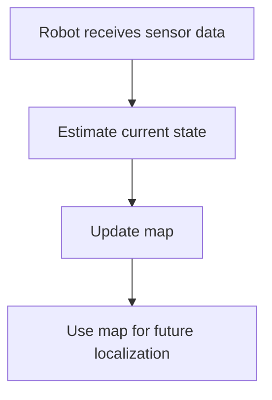

The goal is to help me read, understand, and study the important concepts in these books/documents. The reports must be written in **Obsidian Markdown format**, so they display correctly inside Obsidian.

# Main Requirements

For each chapter/document, create a separate Markdown report file.

At the very top of every report, add Obsidian YAML frontmatter in this form:

```markdown
---
title: Chapter or document title
source: Source file path or source name
tags:
  - main-topic
  - study-report
  - chapter-report
  - example-key-term
---
```

Fill in `title`, `source`, and `tags` for the specific chapter/document. Do not omit this frontmatter unless explicitly requested.

For `tags`, include detailed Obsidian-friendly tags that match the actual report content:

- Use lowercase `kebab-case`.
- Include broad subject tags, such as `slam`, `visual-slam`, `optimization`, or `camera-model`.
- Include report-structure tags such as `study-report` and `chapter-report`.
- Include important concepts and chapter elements, such as `visual-odometry`, `loop-closure`, `pose-optimization`, `camera-intrinsics`, or `least-squares`.
- Make tags specific to the chapter instead of reusing only generic tags.

Suggested file names:

- `Chapter 1 - Introduction.md`
- `Chapter 2 - Chapter Title.md`
- `Chapter 3 - Chapter Title.md`
- `Chapter 4 - Chapter Title.md`

Each chapter report should include:

1. A clear chapter title.
2. A short overview of the chapter.
3. Detailed explanations of important concepts.
4. Definitions of key terms.
5. Step-by-step explanations for difficult ideas.
6. Important formulas using proper Markdown math syntax.
7. Examples from the chapter when useful.
8. Connections to related ideas from other chapters.
9. Obsidian callouts for important notes, warnings, tips, and summaries.
10. Figures from the PDF when they help explain the content.
11. Mermaid diagrams when they make the explanation easier to understand.

# Obsidian Markdown Rules

Use standard Obsidian-compatible Markdown.

For math formulas:

- Use inline math like this: `$x_t$`
- Use block math like this:

```latex
$$
x_t = f(x_{t-1}, u_t)
$$
```

Do not write formulas only as plain text if they are mathematical expressions.

For example, instead of writing:

```text
T_WC = [R_WC, t_WC]
```

write:

```latex
$$
T_{WC} =
\begin{bmatrix}
R_{WC} & t_{WC} \\
0 & 1
\end{bmatrix}
$$
```

# Obsidian Callouts

Use Obsidian callouts when useful.

Examples:

```markdown
> [!info]
> This explains useful background information.

> [!tip]
> This gives a helpful way to remember the concept.

> [!warning]
> This explains a common mistake or confusing point.

> [!summary]
> This summarizes the most important idea of the section.
```

Use callouts naturally inside the report, not only at the end.

# Internal Links Between Chapters

When a concept in one chapter is related to another chapter, add Obsidian internal links.

Example:

```markdown
This idea is closely related to [[Chapter 2 - Robot Motion]] because both explain how robot movement is represented.
```

Use links only when the relationship is meaningful.

Examples of useful links:

```markdown
[[Chapter 1 - Introduction]]
[[Chapter 2 - Robot Motion]]
[[Chapter 3 - Sensors]]
[[Chapter 4 - State Estimation]]
```

Also link sections inside the same chapter when useful.

Example:

```markdown
This will be used later in [[Chapter 2 - Robot Motion#Motion Model]].
```

# Images and Figures

If figures, diagrams, charts, or visual explanations from the PDF is useful for understanding a concept, extract images from the book and insert it directly in the relevant section.

Important rules:

- Do not put all images in a separate image section.
- Place each image exactly where the concept is being explained.
- Only use images that help understanding.
- Use clear image file names.
- Add a short caption below each image.
- The image should be compatible with Obsidian.

Use this exact image caption format:

```markdown
| ![[image-name.png]] |
| :----------------: |
| Figure name |
```

Example:

```markdown
| ![[Pasted image 20250713210042.png]] |
| :----------------------------------: |
| The possible location of a single pixel |
```

When extracting images, save them in a suitable folder such as:

```text
attachments/
```

Then insert them like this:

```markdown
| ![[attachments/chapter-1-slam-overview.png]] |
| :------------------------------------------: |
| Overview of the SLAM problem |
```

# Mermaid Diagrams

You may use Mermaid diagrams when they help explain a concept more clearly.

Use Mermaid diagrams for:

- Algorithms
- Workflows
- Relationships between concepts
- SLAM system structure
- Sensor-processing pipelines
- State estimation pipelines
- Optimization pipelines
- Coordinate frame relationships

Use Obsidian-compatible Mermaid syntax.

Example:




# Writing Style

Write the report as detailed study notes, not as a short summary.

The writing should be:

- Clear
- Easy to understand
- Detailed enough for learning
- Well structured
- Suitable for reviewing later in Obsidian
- Written in your own words
- Focused on helping me understand the concepts deeply

Avoid copying long passages from the book. Explain the ideas in your own words.

# Output Requirements

Make sure that:
- Markdown is clean and readable.
- Math formulas use `$...$` or `$$...$$`.
- Images are inserted near the relevant explanation.
- Image captions follow the required table format.
- Mermaid diagrams are valid and Obsidian-compatible.
- Related concepts are linked using Obsidian internal links.
- The reports are detailed enough for serious study.
- The writing is easy to understand and useful for learning.
